# Execution Model

This document describes how instancy executes logical dataflows: worker-pool scheduling, logical workers, staged execution, external I/O boundaries, and the runtime rules that keep throughput, ordering, and backpressure predictable.

Back to the overview: [Design Overview](./README.md)

## 5. Execution Model

### 5.1 Dual-Layer Architecture: Worker Thread Pool + I/O Runtime

instancy separates **computation** from **I/O** into two distinct layers:

1. **Worker Thread Pool** (custom, lightweight) — a dedicated thread pool that executes operator logic. Operators are pure synchronous functions: take input batches, compute, produce output batches. No async, no I/O, no `await` points in operator code.

2. **I/O Runtime** (Tokio) — handles asynchronous I/O: reading input streams, network send/recv for inter-process exchange, progress message exchange. This is a standard Tokio runtime, either provided by the caller or created internally.

```
┌─────────────────────────────────────────────────────────────────────┐
│                     Worker Thread Pool (custom)                            │
│               Lightweight worker threads for operator logic          │
│                                                                     │
│  ┌─────────┐ ┌─────────┐ ┌─────────┐ ┌─────────┐                  │
│  │Thread 0 │ │Thread 1 │ │Thread 2 │ │Thread 3 │  (dynamic count)  │
│  │         │ │         │ │         │ │         │                    │
│  │ poll    │ │ poll    │ │ poll    │ │ poll    │                    │
│  │ queue   │ │ queue   │ │ queue   │ │ queue   │                    │
│  └────┬────┘ └────┬────┘ └────┬────┘ └────┬────┘                   │
│       └────────────┴──────────┴────────────┘                        │
│                          │                                           │
│                 Shared Task Queue                                    │
│          (lock-free, work-stealing deque)                           │
└─────────────────────────────────────────────────────────────────────┘
                          ▲ enqueue                    │ results
                          │                           ▼
┌─────────────────────────────────────────────────────────────────────┐
│                     I/O Runtime (Tokio)                              │
│        Handles async streams, networking, progress exchange          │
│                                                                     │
│  ┌───────────────┐  ┌───────────────┐  ┌─────────────────────┐     │
│  │ Input reader  │  │ Network I/O   │  │ Progress exchange    │     │
│  │ (from_stream) │  │ (connections) │  │ (cross-process)     │     │
│  └───────────────┘  └───────────────┘  └─────────────────────┘     │
└─────────────────────────────────────────────────────────────────────┘
```

**Why not Tokio for computation?**

Operator logic is purely synchronous in-memory work: take a `Vec<D>` input, apply a function, produce a `Vec<D>` output. There are no I/O operations, no `await` points, no syscalls. Using Tokio for this adds unnecessary overhead:
- Tokio's task scheduler optimizes for I/O-bound workloads with many await points
- Each `poll()` invocation in Tokio has overhead from the vtable dispatch, waker management, and cooperative scheduling
- Tokio's work-stealing across all runtime threads adds contention for CPU-bound work
- The `Send + Sync + 'static` requirements for spawned tasks add complexity

A Custom Worker Thread Pool eliminates this overhead. Each worker thread simply:
1. Dequeues a task (operator activation) from the shared queue
2. Runs the operator's synchronous closure to completion
3. Enqueues results into downstream operators' input buffers
4. Loops back to step 1

No async machinery, no wakers, no futures — just function calls.

### 5.2 Custom Worker Thread Pool

The Worker Thread Pool is a lightweight, purpose-built thread pool optimized for short-to-medium synchronous computation tasks.

```rust
/// Configuration for the compute thread pool.
pub struct WorkerPoolConfig {
    /// Minimum number of worker threads (always kept alive).
    /// Default: 2 or num_cpus::get() / 2, whichever is larger.
    pub min_threads: usize,
    /// Maximum number of worker threads the pool can grow to.
    /// Default: num_cpus::get().
    pub max_threads: usize,
    /// How long a thread can be idle before being shut down.
    /// Only threads above `min_threads` are eligible for shutdown.
    /// Uses exponential backoff: spin → yield → park(short) → park(long) → shutdown.
    /// Default: 30s.
    pub idle_shutdown: Duration,
}

/// The Worker Thread Pool manages worker threads that execute operator tasks.
pub struct WorkerPool {
    config: WorkerPoolConfig,
    /// Shared task queue. Worker threads poll from this.
    task_queue: Arc<TaskQueue>,
    /// Active thread handles for lifecycle management.
    threads: Vec<JoinHandle<()>>,
    /// Count of currently active (non-idle) threads.
    active_count: Arc<AtomicUsize>,
}
```

#### Thread Lifecycle & Dynamic Scaling

Worker threads follow a **spin → yield → park → shutdown** idle strategy:

```
┌─────────┐    no task     ┌─────────┐    still idle    ┌─────────────┐
│ POLLING │───────────────▶│ YIELDING│─────────────────▶│ PARKED      │
│ (spin)  │                │ (yield) │                  │ (condvar)   │
└─────────┘                └─────────┘                  └──────┬──────┘
     ▲                          ▲                              │
     │        new task          │       new task               │ idle > timeout
     └──────────────────────────┴──────────────────────────────│──────────┐
                                                               ▼          │
                                                         ┌───────────┐   │
                                                         │ SHUTDOWN  │◀──┘
                                                         │ (if > min)│
                                                         └───────────┘
```

1. **Spinning** (1-10 iterations): Thread checks the queue in a tight loop. Zero latency for back-to-back tasks.
2. **Yielding** (~100μs): Thread calls `std::thread::yield_now()`, giving CPU to other threads while remaining responsive.
3. **Parking** (condvar wait): Thread parks on a condition variable. Woken by a new task enqueue. Near-zero CPU usage while parked.
4. **Shutdown**: After `idle_shutdown` duration with no work, threads above `min_threads` exit. The pool shrinks to conserve resources.

**Growing the pool**: When a task is enqueued and all threads are busy (active_count == current thread count < max_threads), a new thread is spawned immediately.

```rust
impl WorkerPool {
    /// Submit a task for execution on the Worker Thread Pool.
    pub fn submit(&self, task: ComputeTask) {
        self.task_queue.push(task);
        
        // If all threads are busy and we're below max, spawn a new one
        if self.active_count.load(Ordering::Relaxed) >= self.threads.len()
            && self.threads.len() < self.config.max_threads
        {
            self.spawn_thread();
        }
        
        // Wake a parked thread if any
        self.task_queue.notify_one();
    }
}
```

#### Worker Thread Loop

```rust
fn worker_thread_loop(queue: &TaskQueue, pool_state: &PoolState) {
    let mut idle_cycles = 0u32;
    
    loop {
        // Try to dequeue a task
        if let Some(task) = queue.pop() {
            idle_cycles = 0;
            task.execute();  // Synchronous! No async, no futures.
            continue;
        }
        
        // No task available — idle strategy
        idle_cycles += 1;
        
        if idle_cycles < SPIN_LIMIT {
            // Phase 1: spin (very short, for back-to-back tasks)
            std::hint::spin_loop();
        } else if idle_cycles < YIELD_LIMIT {
            // Phase 2: yield (give CPU but stay responsive)
            std::thread::yield_now();
        } else {
            // Phase 3: park on condvar (minimal CPU, woken on new task)
            let parked_at = Instant::now();
            queue.park_thread(pool_state.idle_shutdown);
            
            // Check if we should shut down
            if parked_at.elapsed() >= pool_state.idle_shutdown
                && pool_state.thread_count() > pool_state.min_threads
            {
                // Exit this thread — pool shrinks
                pool_state.decrement_thread_count();
                return;
            }
        }
    }
}
```

### 5.2a Runtime Tiers & Async Completion

instancy now has one production runtime: `RuntimeHandle`. A dataflow is always executed as `spawn()` + `join()`; there is no separate public `run()` or `run_blocking()` API.

`SimpleRuntime` still exists, but only behind the `test-utils` feature for tests and lightweight local experimentation.

| Runtime | Execution | API style | Use case |
|---|---|---|---|
| `SimpleRuntime` (`test-utils`) | Dedicated OS thread per dataflow | `spawn()` + `join()` | Tests, scripts, prototyping |
| `RuntimeHandle` | Shared worker pool | `spawn()` + `join()` / `join_blocking()` | Production workloads |

A synchronous caller uses the compact pattern:

```rust
let rt = RuntimeHandle::new(RuntimeConfig::default())?;
rt.spawn(dataflow, SpawnOptions::default())?
    .join_blocking()?;
```

Async callers keep the completion future returned by `join()`:

```rust
let rt = RuntimeHandle::new(RuntimeConfig::default())?;
let completion = rt.spawn(dataflow, SpawnOptions::default())?.join();
completion.await?;
```

**`DataflowCompletion`** is a `Future<Output=Result<()>>` backed by `Arc<Mutex<SharedState>>` + `Condvar`. It can be `.await`ed in async code or `.wait()`ed for synchronous blocking. `SpawnedDataflow::join()` returns this completion future, while `join_blocking()` is the convenience wrapper for synchronous callers.

**Current model (Phase 1):** The executor sweep loop runs as a single synchronous task on a pool thread. The caller receives a `DataflowCompletion` future that resolves when the executor finishes. The worker thread is occupied for the duration of the sweep loop.

#### Sweep model

A **sweep** is one full pass through the executor's ready queue: it activates each queued operator once (up to `max_activations_per_step`), then propagates progress and updates quiescence counters. Think of it as a single clock tick in a reactor loop:

- **Sweep** = scan all ready operators, activate each, propagate progress, check quiescence.
- **Run** = repeated sweeps until completion or idle.

Each sweep returns a `SweepOutcome` that tells the caller what happened:

| Outcome | Meaning |
|---|---|
| `Completed` | All operators are done - dataflow finished normally |
| `Quiescent` | No operator made progress for N consecutive sweeps, no external inputs |
| `MadeProgress` | At least one operator made progress - more sweeps likely needed |
| `Idle` | No progress this sweep, but quiescence threshold not yet reached |
| `WaitingForInput` | Idle threshold reached but external inputs still open |

The spawned executor repeatedly calls `run_one_sweep()`. The async executor path uses `poll_run()` to register a waker and return `Pending` when the dataflow is idle.

**Async executor (Phase 2 - implemented):** The executor's sweep loop is a `Future` that yields when idle (no operator made progress). This requires:

1. **Channel waker integration** - `WakeHandle` is a per-dataflow notification primitive (`AtomicBool` + `Mutex<Option<Waker>>`). Bounded channels notify it on push, close, drop, and when pulling frees capacity (backpressure relief).
2. **Executor as Future** - `poll_run()` runs sweeps until idle, then registers a waker via the `WakeHandle`. Uses a race-safe protocol: register waker -> re-check for notifications -> only return `Pending` if no notification pending.
3. **Task scheduler multiplexing** - the worker pool's `ExecutorRegistry` polls multiple executor futures on the same thread with per-task CAS-based state machine (`IDLE -> QUEUED -> POLLING -> DONE`) and `PoolWaker` for async re-enqueue.

**Async I/O (Phase 3 - implemented):** `spawn()` stays synchronous because graph construction and channel wiring are pure CPU work. `SpawnOptions` selects the external channel backend at spawn time: `IoMode::Sync` for blocking `std::sync::mpsc`, or `IoMode::Async` for `tokio::sync::mpsc`. Async I/O is always available.

The key insight: the **executor** is already async (Phase 2), but the **I/O boundary** is chosen per spawn. `AsyncInputSender` and `AsyncOutputReceiver` are async wrappers around `tokio::sync::mpsc` channels that integrate with the executor's `WakeHandle` for backpressure-aware async data flow.

#### Channel Mode Selection

The channel type is chosen at spawn time via `SpawnOptions`:

| Spawn call | Channel type | I/O handles | Use case |
|---|---|---|---|
| `rt.spawn(dataflow, SpawnOptions::default())` | `std::sync::mpsc` | `InputSender` / `OutputReceiver` | Default sync channel I/O |
| `rt.spawn(dataflow, SpawnOptions::new().io_mode(IoMode::Async))` | `tokio::sync::mpsc` | `AsyncInputSender` / `AsyncOutputReceiver` | Async producers and consumers |

Both modes share the same `ChannelSourceOperator` and `ChannelSinkOperator` via the `InputRecv` / `OutputSend` enum dispatch - the operator code doesn't know which channel backend is active:

```rust
/// Channel receive half - sync or async, selected at spawn time.
enum InputRecv<T> {
    Std(std::sync::mpsc::Receiver<T>),
    Tokio(tokio::sync::mpsc::Receiver<T>),
}

/// Channel send half - sync or async, selected at spawn time.
enum OutputSend<T> {
    Std(std::sync::mpsc::SyncSender<T>),
    Tokio(tokio::sync::mpsc::Sender<T>),
}
```

Both variants expose a `try_recv()` / `try_send()` interface that works without a tokio runtime context - important because operator code runs on the custom worker pool threads, not on tokio threads.

#### AsyncInputSender

`AsyncInputSender<T, D>` wraps a `tokio::sync::mpsc::Sender` and the dataflow's `WakeHandle`. It provides the same API as the sync `InputSender`:

```rust
// Feed data into a running dataflow
let sender = handle.take_async_input::<i32>("numbers").unwrap();

// Send a batch - awaits if the channel is full (backpressure)
sender.send(timestamp, vec![1, 2, 3]).await?;

// Advance the input frontier
sender.advance_to(next_timestamp).await?;

// Signal input complete - drops all capabilities
sender.close();
```

Key properties:
- **Clone**: multiple producers can feed the same input (channel closes when all drop)
- **WakeHandle integration**: each `send()` notifies the executor's WakeHandle, waking it from idle to process the new data
- **Backpressure**: `send().await` yields when the channel is full, naturally integrating with tokio's cooperative scheduling

#### AsyncOutputReceiver

`AsyncOutputReceiver<T, D>` wraps a `tokio::sync::mpsc::Receiver` and the dataflow's `WakeHandle`. It provides an async stream-like interface:

```rust
// Collect results from a running dataflow
let mut out = handle.take_async_output::<String>("results").unwrap();

// Receive events - awaits until data is available
while let Some(event) = out.recv().await {
    if let OutputEvent::Data { time, data } = event {
        println!("t={time}: {data:?}");
    }
}
// None means the output is exhausted (dataflow complete)

// Or use the convenience helper to collect all data batches:
// let results: Vec<(T, Vec<D>)> = out.collect_data().await;
```

Key properties:
- **WakeHandle integration**: each `recv()` notifies the executor's WakeHandle after consuming data, relieving backpressure on sink operators
- **Drop notification**: dropping the receiver notifies the WakeHandle, so backpressured sinks don't block forever if the consumer is cancelled

#### End-to-End Async Flow

```
Producer task                  Worker Pool                    Consumer task
(tokio thread)                 (custom threads)               (tokio thread)
     |                               |                              |
     | sender.send(t, data).await    |                              |
     +-------- tokio::mpsc --------->|                              |
     |                          try_recv()                          |
     |                     ChannelSourceOperator                    |
     |                          activates                          |
     |                               |                              |
     |                     operator pipeline                        |
     |                     (map -> filter -> ...)                  |
     |                               |                              |
     |                     ChannelSinkOperator                      |
     |                          try_send()                         |
     |                               +-------- tokio::mpsc ------->|
     |                                                    out.recv().await
```

#### Panic Safety

All mutex locks in the async I/O path use poison-safe patterns (Phase 3.5):
- Bounded channels: `lock().ok()` / `lock().map_err()` - errors propagate naturally
- WakeHandle: `lock().unwrap_or_else(|e| e.into_inner())` for waker registration
- CompletionNotifier: `into_inner()` ensures completion signal always delivered

```rust
// Example: async I/O end-to-end
let rt = RuntimeHandle::new(RuntimeConfig {
    worker_threads: 4,
    ..Default::default()
}).unwrap();
let mut spawned = rt.spawn(
    dataflow,
    SpawnOptions::new().io_mode(IoMode::Async),
)?;

let sender = spawned.take_async_input::<i32>("data").unwrap();
let mut output = spawned.take_async_output::<String>("results").unwrap();
let completion = spawned.join();

// Producer
tokio::spawn(async move {
    sender.send(0, vec![1, 2, 3, 4, 5]).await.unwrap();
    sender.close();
});

// Consumer
while let Some(event) = output.recv().await {
    if let OutputEvent::Data { time, data } = event {
        println!("t={time}: {data:?}");
    }
}

completion.await?;
```

```
Phase 1 (sync):                      Phase 2 (async executor):           Phase 3 (async I/O):
┌──────────────┐                     ┌──────────────┐                    ┌──────────────┐
│ Worker Thread │                     │ Worker Thread │                    │ Worker Thread │
│              │                     │              │                    │              │
│ executor sweep loop <- blocks     │ poll(exec_A)  <- Pending         │ poll(exec_A)  <- Pending
│ until completion                  │ poll(exec_B)  <- Ready           │ poll(exec_B)  <- Ready
│              │                     │ poll(exec_C)  ← Pending          │              │
│              │                     │ ... park ...  │                    │ ... park ...  │
└──────────────┘                     └──────────────┘                    └──┬───────┬───┘
                                                                           │       │
                                                            tokio::mpsc ◄──┘       └──► tokio::mpsc
                                                           (async input)           (async output)
```

### 5.3 Logical Workers & Task Queue

We retain the concept of a **logical worker ID** — a `WorkerId` — which serves three purposes:

1. **FIFO ordering**: All operator tasks assigned to the same `WorkerId` execute in FIFO sequence. This is enforced by per-worker task sub-queues that are drained into the shared pool queue sequentially.

2. **Parallelism control**: A dataflow stage declares its parallelism (e.g., 4). The pool ensures that **at most N tasks from that stage are executing concurrently** using a lightweight counting semaphore.

3. **Data partitioning**: The `exchange` operator routes data by `hash(item) % total_workers`. The `WorkerId` determines which partition an operator instance belongs to.

#### Heterogeneous Worker Assignment

Unlike timely-dataflow where every process must run the same number of workers, instancy allows **each node to declare its own worker count** based on its available resources (CPU cores, memory, etc.). The global worker set is the union of all per-node workers, and each worker is assigned a globally unique `WorkerId`.

```
Example: 3-node cluster with heterogeneous workers

  Node 0 (8-core machine)     Node 1 (4-core machine)     Node 2 (16-core machine)
  workers: 4                  workers: 2                   workers: 6
  ┌────┬────┬────┬────┐       ┌────┬────┐                  ┌────┬────┬────┬────┬────┬────┐
  │ W0 │ W1 │ W2 │ W3 │       │ W4 │ W5 │                  │ W6 │ W7 │ W8 │ W9 │W10 │W11 │
  └────┴────┴────┴────┘       └────┴────┘                  └────┴────┴────┴────┴────┴────┘

  Total workers: 12
  exchange routes: hash(item) % 12
```

```rust
/// A globally unique logical worker identity.
/// Not tied to any physical OS thread.
#[derive(Clone, Copy, Debug, Hash, Eq, PartialEq, Ord, PartialOrd)]
pub struct WorkerId(pub usize);

/// Describes the worker topology of a node in the cluster.
#[derive(Clone, Debug)]
pub struct NodeConfig {
    /// Unique identity of this node (typically IP:port, hostname, or URI).
    /// Must be stable across reconnections of the same physical node.
    pub node_id: String,
    /// Number of logical workers hosted by this node.
    /// Can differ from other nodes based on this node's capacity.
    pub workers: usize,
}

/// Configuration for the instancy runtime.
pub struct RuntimeConfig {
    /// Worker Thread Pool configuration (the custom thread pool for operator logic).
    pub compute_pool: WorkerPoolConfig,
    /// Optional: provide an existing Tokio runtime handle for I/O tasks.
    /// If None, instancy creates a minimal Tokio runtime internally.
    /// The Tokio runtime is used ONLY for I/O: input stream reading,
    /// network connections, and inter-process progress exchange.
    pub io_runtime: Option<tokio::runtime::Handle>,
    /// Progress tracking mode.
    pub progress_mode: ProgressMode,
}
```

> **Runtime isolation**: The caller application can provide a dedicated Tokio runtime handle for instancy's I/O tasks via `RuntimeConfig::io_runtime`. This keeps instancy's network and input reading separate from the application's own async work. The Worker Thread Pool is always isolated by design (it's a separate thread pool from any Tokio runtime).
>
> ```rust
> // Application creates a minimal Tokio runtime for instancy I/O only
> let io_runtime = tokio::runtime::Builder::new_multi_thread()
>     .worker_threads(2)  // I/O doesn't need many threads
>     .thread_name("instancy-io")
>     .build()?;
>
> let config = RuntimeConfig {
>     compute_pool: WorkerPoolConfig {
>         min_threads: 4,
>         max_threads: 16,
>         idle_shutdown: Duration::from_secs(30),
>     },
>     io_runtime: Some(io_runtime.handle().clone()),
>     progress_mode: ProgressMode::Eager,
> };
>
> // The application's own Tokio runtime is completely unaffected
> ```

```rust
/// Per-dataflow configuration.
pub struct DataflowConfig {
    /// The cluster topology: describes all participating nodes and their worker counts.
    /// For single-process mode, this is just one NodeConfig.
    pub cluster: ClusterTopology,
    /// Cancellation token for this dataflow.
    pub cancellation_token: CancellationToken,
}

/// Describes the full cluster topology.
#[derive(Clone, Debug)]
pub struct ClusterTopology {
    /// All nodes in the cluster, ordered by their position in the topology.
    pub nodes: Vec<NodeConfig>,
}

impl ClusterTopology {
    /// Total number of logical workers across all nodes.
    pub fn total_workers(&self) -> usize {
        self.nodes.iter().map(|n| n.workers).sum()
    }
    
    /// Returns the global WorkerId range assigned to a given node.
    pub fn worker_range(&self, node_id: &str) -> Option<std::ops::Range<usize>> {
        let mut start = 0;
        for node in &self.nodes {
            if node.node_id == node_id {
                return Some(start..start + node.workers);
            }
            start += node.workers;
        }
        None
    }
    
    /// Determines which node hosts a given global WorkerId.
    pub fn node_for_worker(&self, worker_id: WorkerId) -> Option<&str> {
        let mut offset = 0;
        for node in &self.nodes {
            if worker_id.0 < offset + node.workers {
                return Some(&node.node_id);
            }
            offset += node.workers;
        }
        None
    }
}
```

**How logical workers are enforced on the Worker Thread Pool:**

Each logical `WorkerId` has a per-worker FIFO queue. The Worker Thread Pool processes these queues respecting FIFO ordering per worker and concurrency limits per stage:

```
┌──────────────────────────────────────────────────────────────────┐
│                     Worker Thread Pool (custom threads)                 │
│             Threads poll from shared queue, run tasks             │
│                                                                  │
│  Dataflow A (stage: parallelism=4)                               │
│  ┌─────────────┐ ┌─────────────┐ ┌─────────────┐ ┌────────────┐│
│  │ Worker 0    │ │ Worker 1    │ │ Worker 2    │ │ Worker 3   ││
│  │ ┌─────────┐ │ │ ┌─────────┐ │ │ ┌─────────┐ │ │ ┌────────┐ ││
│  │ │Op: map  │ │ │ │Op: map  │ │ │ │Op: map  │ │ │ │Op: map │ ││
│  │ │Op: filter│ │ │ │Op: filter│ │ │ │Op: filter│ │ │ │Op: flt│ ││
│  │ │  (FIFO) │ │ │ │  (FIFO) │ │ │ │  (FIFO) │ │ │ │(FIFO) │ ││
│  │ └─────────┘ │ │ └─────────┘ │ │ └─────────┘ │ │ └────────┘ ││
│  └─────────────┘ └─────────────┘ └─────────────┘ └────────────┘│
│                                                                  │
│  Concurrency limit: at most 4 tasks from this stage run at once  │
│                                                                  │
│  Dataflow B (stage: parallelism=2) — shares the same threads    │
│  ┌─────────────┐ ┌─────────────┐                                │
│  │ Worker 0    │ │ Worker 1    │                                │
│  └─────────────┘ └─────────────┘                                │
│                                                                  │
│  Multiple dataflows share the pool, each respecting its limits   │
└──────────────────────────────────────────────────────────────────┘
```

**Task scheduling within the Worker Thread Pool:**

```rust
/// A compute task ready for execution.
struct ComputeTask {
    /// Which logical worker this task belongs to.
    worker_id: WorkerId,
    /// The operator activation to execute.
    activation: OperatorActivation,
    /// Stage concurrency permit (limits parallel tasks per stage).
    stage_permit: Arc<CountingSemaphore>,
}

/// Manages per-worker FIFO queues and dispatches to the pool.
struct TaskScheduler {
    /// Per-worker queues. Tasks within a worker execute in order.
    worker_queues: Vec<VecDeque<OperatorActivation>>,
    /// Shared queue fed to pool threads (ready-to-run tasks).
    ready_queue: Arc<TaskQueue>,
}

impl TaskScheduler {
    /// Called when an operator has input ready.
    /// Enqueues to the worker's FIFO queue.
    fn enqueue(&mut self, worker_id: WorkerId, activation: OperatorActivation) {
        self.worker_queues[worker_id.0].push_back(activation);
        self.try_dispatch(worker_id);
    }
    
    /// Moves the next task from a worker queue to the ready queue
    /// if the worker has no task currently in-flight.
    fn try_dispatch(&mut self, worker_id: WorkerId) {
        if !self.worker_in_flight[worker_id.0] {
            if let Some(task) = self.worker_queues[worker_id.0].pop_front() {
                self.worker_in_flight[worker_id.0] = true;
                self.ready_queue.push(ComputeTask { worker_id, activation: task, .. });
            }
        }
    }
    
    /// Called when a task completes. Dispatches the next task for that worker.
    fn task_completed(&mut self, worker_id: WorkerId) {
        self.worker_in_flight[worker_id.0] = false;
        self.try_dispatch(worker_id);
    }
}
```

### 5.4 Operator Scheduling

Each operator's logic is a **synchronous function** — not an async task. Operators take input, compute, and produce output without any `await` points.

```rust
/// Operator logic signature — purely synchronous.
type OperatorFn<T, C1, C2> = dyn FnMut(
    &mut InputHandle<T, C1>,
    &mut OutputHandle<T, C2>,
) -> Result<(), Error> + Send;
```

When an operator has input data ready, an activation is posted to its logical worker's queue. The Worker Thread Pool's task scheduler dispatches it to a thread when:
1. The worker has no other task in-flight (FIFO guarantee), and
2. The stage's concurrency limit has not been reached.

This gives us:
- **FIFO within a worker**: operators on the same worker are activated in order.
- **Bounded parallelism per stage**: at most N tasks from a stage run concurrently.
- **Zero async overhead**: operator logic is a plain function call on a plain thread.
- **Fair sharing**: multiple dataflows share the same pool threads, with per-stage concurrency limits preventing starvation.
- **Low latency**: spinning phase means back-to-back tasks execute with sub-microsecond scheduling overhead.

```
I/O Runtime (Tokio) ──► reads input stream ──► enqueues to Worker queue
                                                        │
                                              Worker Thread Pool thread picks it up
                                                        │
                                              Operator runs synchronously
                                                        │
                                              Output → downstream worker queue
                                              OR
                                              Output → I/O Runtime (network send)
```

**Operator activation flow:**

1. Data arrives on an operator's input buffer (pushed by upstream, or read by I/O runtime from network/input stream).
2. The task scheduler posts an activation to the operator's `WorkerId` queue.
3. When the worker has no in-flight task and the stage has spare concurrency, the task is moved to the ready queue.
4. A Worker Thread Pool thread dequeues it and calls the operator's synchronous logic.
5. The operator produces output, which is written to downstream input buffers.
6. The thread signals task completion; the scheduler dispatches the next task for that worker.

#### 5.4.1 Completion Propagation

When an operator returns `Done`, the executor marks it as complete and invokes
**topology-driven completion propagation**. This uses pre-computed adjacency
lists (built from the `DataflowGraph` edges during materialization) to determine
which downstream operators should be re-queued immediately.

**Algorithm:**

1. Look up the completed operator's successors from `successors_by_pos`.
2. For each successor, check whether **all** its predecessors are now done
   (using `predecessors_by_pos`).
3. If all predecessors are done and the successor is not already queued,
   re-queue it so it can process remaining buffered data and detect input
   exhaustion.

```
  A ──► B ──► D        When A completes: B is requeued (sole predecessor done).
        ▲               When C completes: D is NOT requeued (B still running).
  C ────┘               When B completes: D IS requeued (both B and C done).
```

**Activation-mode handling:**

| Mode | Requeue target |
|------|---------------|
| Unfused | Operator position → `ready_queue` |
| Fused | Operator position → `ready_queue` (next sweep activates it) |
| Stage-task | Owning stage task index → `ready_queue` |

This ensures downstream operators are activated promptly instead of waiting for
the next idle sweep or progress-tracker cycle. The adjacency lists are computed
once during `DataflowExecutor::materialize()` from both regular and feedback
edges, deduplicated, and stored for O(1) lookup per completion event.

Without topology-driven propagation, the executor relied solely on channel
exhaustion: the completed operator drops its push handles, and eventually the
downstream operator discovers `is_exhausted() = true` on its pull handles.
While correct, this passive approach could delay completion detection in unfused
mode where idle operators are not in the ready queue.

#### 5.4.2 Who Creates Tasks? — The Orchestrator Event Loop

The **orchestrator** (also called the runtime event loop) is the component responsible
for receiving data messages and turning them into compute tasks. It runs on the I/O
runtime and performs the following for each operator input:

1. **Receives messages** — from local in-process channels (downstream output buffers)
   or from the network (remote exchange).
2. **Deposits into input buffer** — each operator input has a per-worker buffer where
   incoming messages accumulate.
3. **Feeds the BatchAccumulator** — calls `BatchAccumulator::record_message()` for
   each incoming message. The accumulator tracks count, byte size, and elapsed time
   since the first message in the current batch (see [§12.7.2a](./decisions.md#1272a-time-bounded-message-batching) in decisions.md).
4. **Checks dispatch threshold** — calls `BatchAccumulator::should_dispatch(policy)`.
   When any threshold is met (count, bytes, or time), the batch is ready.
5. **Creates an OperatorActivation** — wraps a closure that will invoke the operator's
   `FnMut` logic with a reference to the filled input buffer. The closure captures
   access to the operator's input/output handles.
6. **Enqueues into TaskScheduler** — calls `TaskScheduler::enqueue(activation, stage_id)`.
   The scheduler places it in the per-worker FIFO queue.
7. **Resets the accumulator** — calls `BatchAccumulator::reset()` to start fresh for
   the next batch.

```
                    ┌──────────────────────────────────────┐
                    │   Orchestrator Event Loop (I/O side)  │
                    │                                      │
   messages ──────►│  1. Receive message                   │
   (channel/net)   │  2. Deposit into operator input buf   │
                    │  3. BatchAccumulator.record_message() │
                    │  4. should_dispatch(policy)?          │
                    │     NO  → wait for more messages      │
                    │     YES → create OperatorActivation   │
                    │  5. TaskScheduler.enqueue(activation)  │
                    │  6. BatchAccumulator.reset()           │
                    └──────────────────────┬───────────────┘
                                           │
                                           ▼
                    ┌──────────────────────────────────────┐
                    │   TaskScheduler (per-worker FIFO)     │
                    │                                      │
                    │  dispatch_ready() → ComputeTask      │
                    └──────────────────────┬───────────────┘
                                           │
                                           ▼
                    ┌──────────────────────────────────────┐
                    │   Worker Thread Pool (compute)        │
                    │   thread picks up task, runs closure  │
                    └──────────────────────────────────────┘
```

The orchestrator also manages a **timer wheel** (or per-operator deadlines) for the
`max_batch_wait` threshold: if no new messages arrive but time expires, the
orchestrator fires the activation anyway to ensure bounded latency.

#### 5.4.3 Where is Operator State Stored?

Operator state (e.g., a `HashMap` for aggregation, a running counter, a window buffer)
lives **inside the operator's closure**. The operator logic is declared as:

```rust
logic: Box<dyn FnMut(&mut InputHandle<T, D1>, &mut OutputHandle<T, D2>) -> Result<()> + Send>
```

Because this is `FnMut` (not `FnOnce`), the closure is **invoked repeatedly** across
activations and retains mutable state between calls. The state is simply captured
variables in the closure:

```rust
// Example: stateful aggregation operator
let mut counts: HashMap<String, u64> = HashMap::new();  // ← operator state

stream.unary("word_count", |input, output| {
    // `counts` is moved into this FnMut closure and persists across activations
    while let Some((time, batch)) = input.next() {
        for word in batch {
            *counts.entry(word).or_insert(0) += 1;
        }
        output.session(&time).give_vec(counts.iter().collect());
    }
    Ok(())
});
```

**Key design properties:**

- **One closure instance per logical worker** — there is no sharing of state across
  workers. Each worker has its own independent operator instance with its own state.
  No locking or synchronization is needed to access operator state.

- **The orchestrator owns the operator struct** — the `UnaryOperator` (or `BinaryOperator`)
  struct lives in the orchestrator's operator registry. When an activation fires, the
  orchestrator calls the operator's `activate()` method which invokes the `FnMut` closure.
  The state persists for the operator's entire lifetime.

- **Thread safety via FIFO guarantee** — even though the Worker Thread Pool may run the
  closure on different OS threads across activations, the per-worker FIFO guarantee
  ensures the closure is **never called concurrently**. It is `Send` (can move between
  threads) but never needs to be `Sync`.

- **No external state store needed** — unlike actor frameworks that require a separate
  "state" object, the closure-capture pattern is natural Rust: the compiler enforces
  move semantics and lifetime correctness. The operator "is" its closure + captured state.

- **State lifetime** — operator state lives as long as the dataflow is running. When the
  dataflow is dropped or cancelled, the operator struct (and its closure with all captured
  state) is dropped, freeing all resources.

#### 5.4.4 Operator Instantiation & the SPMD Model

In the SPMD model, each logical worker independently builds and runs the same dataflow graph. When a stage has parallelism=5, there are 5 workers, each creating its own instance of every operator in that stage. The **operator index is the same** across all workers — what differs is the **worker ID**.

```
Stage (parallelism=5):
  Worker 0: operator "filter" (index=3), operator "aggregate" (index=4)
  Worker 1: operator "filter" (index=3), operator "aggregate" (index=4)
  Worker 2: operator "filter" (index=3), operator "aggregate" (index=4)
  Worker 3: operator "filter" (index=3), operator "aggregate" (index=4)
  Worker 4: operator "filter" (index=3), operator "aggregate" (index=4)

Each instance is independent — no shared state between workers.
Operator full identity: (worker_id, operator_index)
```

**How instantiation works:**

Each worker runs the graph-building code independently (this is the "single program" in SPMD). Each worker's `.unary(name, logic)` call creates a **new `OperatorFactory`** which, when called at materialization time, produces a new operator with fresh state. The factory closure is `FnMut` and clones the user logic on each `build()` call, giving each worker an independent copy.

```rust
// This code runs on EACH worker independently:
stream.unary("word_count", |input, output| {
    // Each worker gets its own HashMap — no sharing.
    let mut counts: HashMap<String, u64> = HashMap::new();
    // ...
});
```

**Key properties:**

- The `OperatorFactory` wraps a `FnMut` closure — it can be called multiple times, cloning captured state on each `build()` to give each worker independent state.
- In the current model, each worker creates its own factory; in the target model (build-once-materialize-N), a single factory is called N times.
- For stateful operators, each worker's instance accumulates state only for its own data partition (ensured by `exchange()` routing).
- Operator state is never shared across workers — no locks, no synchronization needed.

#### 5.4.5 Dynamic Operator Generation (Query Engine Integration)

The `OperatorFactory` pattern supports **dynamic operator generation** — operators created at runtime from a query plan or other configuration rather than being statically coded. This is essential for integration with query engines like Apache DataFusion, where SQL logical plans are compiled into physical instancy operators.

**Use case: datafusion-instancy (distributed SQL execution)**

A `datafusion-instancy` extension crate would convert DataFusion logical plans into instancy dataflow graphs:

1. DataFusion produces a logical plan: `Scan → Filter → Project → HashAgg → Exchange → MergeAgg`
2. The extension crate walks the plan and creates an `OperatorFactory` for each node, capturing the node's **serializable configuration** (filter expressions, column projections, aggregation functions, join keys)
3. Factories are registered in the `DataflowGraph`
4. At materialization, each factory creates the concrete physical operator

```rust
/// Example: converting a logical plan node to an OperatorFactory.
/// This runs on each node independently (SPMD) after receiving the plan.
fn plan_node_to_factory(node: &LogicalPlan) -> OperatorFactory {
    match node {
        LogicalPlan::Filter { predicate, .. } => {
            let expr = compile_predicate(predicate); // serializable config
            Box::new(move |endpoints: ChannelEndpoints| {
                Box::new(FilterOperator::new(expr, endpoints))
            })
        }
        LogicalPlan::HashAggregate { group_by, aggr_fns, .. } => {
            let keys = group_by.clone();
            let fns = aggr_fns.clone();
            Box::new(move |endpoints| {
                Box::new(HashAggOperator::new(keys, fns, endpoints))
            })
        }
        // Each logical plan node type maps to a physical operator
    }
}
```

**Why this works with SPMD:**

- The logical plan is **serializable data** (expressions, column names, types) — not Rust closures
- The coordinator sends the plan (protobuf/JSON) to each participating node
- Each node deserializes the plan, calls `plan_node_to_factory()` for each node, builds the graph, and runs
- The `datafusion-instancy` crate defines extended operator types (FilterOperator, HashAggOperator, etc.) that implement `SchedulableOperator`
- All operators work with `RecordBatch` (Arrow columnar format) as the data type `D`

**Design requirements this imposes on instancy:**

- `OperatorFactory` must remain a simple concrete struct wrapping `FnMut(&WorkerContext, ChannelEndpoints) -> Result<Box<dyn SchedulableOperator>>` — no complex trait hierarchies that prevent dynamic dispatch
- `SchedulableOperator` trait must be implementable by external crates (no sealed traits, no unstable associated types)
- Channel data type `D` must support `RecordBatch` and similar large columnar types efficiently (zero-copy where possible)
- The `DataflowGraph` metadata must be constructable programmatically (not only via the `.unary()` / `.binary()` extension traits) so query planners can build graphs from plan trees

### 5.4.6 Input Streams

The executor accepts a dataflow definition that binds external async streams as inputs. Instead of the caller imperatively calling `input.send()` and `input.advance_to()`, the dataflow is driven by `TimestampedInput` streams — async streams that yield timestamped data. The library reads from these streams, manages capabilities and frontier advancement automatically, and the dataflow makes progress reactively as data arrives.

```rust
/// A timestamped item from an external input stream.
#[derive(Debug, Clone)]
pub enum InputEvent<T: Timestamp, D> {
    /// A batch of data at the given timestamp.
    Data(T, Vec<D>),
    /// Explicitly advance the frontier to this timestamp.
    /// All future Data events must have timestamps >= this value.
    Frontier(T),
}

/// An async stream that produces timestamped input for a dataflow.
pub trait TimestampedInput<T: Timestamp, D>:
    Stream<Item = InputEvent<T, D>> + Send + Unpin + 'static
{}

// Blanket implementation
impl<T, D, S> TimestampedInput<T, D> for S
where
    T: Timestamp,
    S: Stream<Item = InputEvent<T, D>> + Send + Unpin + 'static,
{}
```

**How the library drives the dataflow:**

For each input stream, the library spawns a dedicated async task that:
1. Reads `InputEvent`s from the user's async stream.
2. On `Data(t, batch)` — posts the batch into the owning worker's task queue at timestamp `t`, holding a capability for `t`.
3. On `Frontier(t)` — drops capabilities for all timestamps `< t`, advancing the input frontier.
4. When the stream ends (`None`) — drops all capabilities, signaling that this input is complete.

The caller never manually manages capabilities or frontier advancement.

### 5.5 Output: Sink-First Model

The orchestrator knows the full dataflow topology — including worker count, placement, and routing — **before** any data flows. Rather than forcing results through an intermediate async channel, the primary output path pushes data directly to a user-provided **`OutputSink`**. An async-stream convenience layer is built on top for cases where pull-based consumption is preferred.

#### OutputSink trait (push-based, primary path)

```rust
/// A timestamped output event emitted by the dataflow.
#[derive(Debug, Clone)]
pub enum OutputEvent<T: Timestamp, D> {
    /// A batch of output data at the given timestamp.
    Data(T, Vec<D>),
    /// The output frontier has advanced to this timestamp.
    /// All future Data events will have timestamps >= this value.
    Frontier(T),
}

/// Push-based sink that the dataflow writes output directly into.
///
/// The orchestrator wires the final operator's output to the sink at
/// construction time — no intermediate async channel sits between the
/// operator and the destination. One sink instance is created per worker
/// in the last stage.
#[async_trait]
pub trait OutputSink<T: Timestamp, D: Send>: Send + Sync {
    /// Called for each output event produced by the final operator.
    /// Returning `Err` signals backpressure or a fatal write failure;
    /// the error policy decides whether to retry, skip, or halt.
    async fn write(&mut self, event: OutputEvent<T, D>) -> Result<()>;

    /// Called once when the dataflow completes for this worker.
    /// Use this to flush buffers, commit transactions, close handles, etc.
    async fn close(&mut self) -> Result<()> {
        Ok(())
    }
}
```

This is the high-throughput path: operator → sink, no channel hop.
Backpressure flows naturally from the storage layer (e.g., a slow database write)
back through the dataflow via the `write` future.

#### OutputStream (pull-based, convenience wrapper)

For testing, small result sets, or interactive consumption, a pull-based
`OutputStream` is provided as a convenience built *on top of* `OutputSink`:

```rust
/// An async stream of output events produced by one worker of the final stage.
/// Internally backed by an OutputSink that writes into a bounded async channel.
pub type OutputStream<T, D> = Pin<Box<dyn Stream<Item = OutputEvent<T, D>> + Send>>;
```

This is implemented as a `ChannelSink` that writes events into a bounded
`mpsc` channel; the `OutputStream` is the receiver end. The caller gets
standard `Stream` combinators, and backpressure still works (a slow consumer
fills the channel, causing the `ChannelSink::write` future to block).

#### Wiring outputs at construction time

Because the orchestrator already knows the number of logical workers and
their physical placement, it can wire outputs directly to their destination
at dataflow construction time:

```rust
// High-throughput: push directly to storage
let handle = execute(config, |builder| {
    let input = builder.input("events");
    input
        .exchange(|e| hash(&e.key))
        .unary("transform", |handle, output| { /* ... */ })
        .output_to("results", BlobStoreSink::new(container));
    Ok(())
}).await?;

// Convenience: pull via async stream
let handle = execute(config, |builder| {
    let input = builder.input("events");
    let streams = input
        .exchange(|e| hash(&e.key))
        .unary("transform", |handle, output| { /* ... */ })
        .output();  // Returns Vec<OutputStream> (one per worker)
    Ok(streams)
}).await?;

// Consume output streams
for (worker_idx, stream) in handle.output_streams().enumerate() {
    tokio::spawn(async move {
        pin_mut!(stream);
        while let Some(event) = stream.next().await {
            match event {
                OutputEvent::Data(time, batch) => {
                    db.write_partition(worker_idx, time, batch).await;
                }
                OutputEvent::Frontier(time) => {
                    db.commit_up_to(worker_idx, time).await;
                }
            }
        }
    });
}
```

**Design rationale**:
- **Sink-first**: The orchestrator knows the full graph topology at construction time. Wiring the final operator directly to its destination avoids an unnecessary channel hop and gives the best throughput.
- **Multiple sinks/streams**: One sink (or stream) per final-stage worker preserves parallelism all the way to the destination. The caller can write to multiple database partitions, files, or network connections concurrently.
- **Frontier events included**: The caller knows when a timestamp is "complete" (no more data at that time will arrive), enabling commit/flush at appropriate points.
- **Backpressure**: In the sink path, backpressure comes from the async `write` future. In the stream path, the bounded channel provides equivalent backpressure. Both propagate naturally back through the dataflow.
- **Pull-based as convenience**: `OutputStream` is useful for tests and interactive use but is not the primary production path — it adds one channel hop compared to a direct sink.

### 5.6 Bootstrap: execute & DataflowSpec

```rust
/// Per-dataflow specification: input streams + graph definition + output streams.
pub struct DataflowSpec<T: Timestamp, D: Data> {
    config: DataflowConfig,
    inputs: Vec<(String, Box<dyn ErasedTimestampedInput<T>>)>,
    builder: Box<dyn FnOnce(DataflowInputs<T>, &mut Scope<T>) -> Result<Vec<Stream<_, Vec<D>>>, Error> + Send>,
}

impl<T: Timestamp, D: Data> DataflowSpec<T, D> {
    pub fn new(config: DataflowConfig) -> Self { /* ... */ }

    /// Attach a named input stream.
    pub fn input<I: Data>(
        mut self,
        name: &str,
        stream: impl TimestampedInput<T, I>,
    ) -> Self { /* ... */ }

    /// Define the dataflow graph. The builder returns the output streams
    /// from the final stage.
    pub fn build<F>(mut self, func: F) -> Self
    where
        F: FnOnce(DataflowInputs<T>, &mut Scope<T>) -> Result<Vec<Stream<_, Vec<D>>>, Error> + Send + 'static,
    { /* ... */ }
}

/// Run one or more dataflows on the Worker Thread Pool + I/O runtime.
/// Returns output streams for each dataflow (one stream per worker in the last stage).
pub async fn execute<T: Timestamp, D: Data>(
    runtime_config: RuntimeConfig,
    spec: DataflowSpec<T, D>,
) -> Result<DataflowHandle<T, D>, Error> {
    // Creates the Worker Thread Pool (or reuses existing),
    // sets up the I/O runtime, builds the dataflow graph,
    // returns a handle with output streams + metrics.
    ...
}

/// Handle to a running or completed dataflow.
pub struct DataflowHandle<T: Timestamp, D: Data> {
    /// Output streams — one per worker in the last stage.
    /// The caller consumes these to receive dataflow results.
    pub outputs: Vec<OutputStream<T, D>>,
    /// Metrics for this dataflow (available after completion).
    pub metrics: tokio::sync::watch::Receiver<DataflowMetrics>,
    /// Cancellation token to stop the dataflow.
    pub cancel: CancellationToken,
}
```

### 5.7 Load Control

Since multiple dataflows share the same Worker Thread Pool, we need controls to prevent one dataflow from starving others:

- **Per-stage concurrency limit**: the primary mechanism. Each stage has a counting semaphore that limits how many tasks from that stage can run concurrently (equal to the stage's parallelism on this node).
- **Bounded input buffers** create natural backpressure — a fast producer's enqueue blocks when the downstream buffer is full.
- **Per-worker FIFO dispatch**: the task scheduler only dispatches the next task for a worker when the current one completes, preventing a single worker from flooding the pool.
- **Cross-dataflow fairness**: since the Worker Thread Pool's shared queue is FIFO across all dataflows, no single dataflow can monopolize threads indefinitely. The round-robin effect of interleaved task completions provides natural fairness.
- **Dynamic thread count**: under-utilized pools shrink (threads shut down), while burst load causes growth up to `max_threads`. This adapts to actual demand.

### 5.7a Backpressure

Backpressure is a critical mechanism that prevents fast operators from overwhelming slow ones. instancy implements **end-to-end backpressure** that traces all the way from any blocked downstream operator back to the input streams.

#### Backpressure Chain

```
Input Stream → Op A → [buffer full] → Op B (slow) → Op C → Output Stream
                 ↑
                 └── Op A's push returns Backpressure error
                     → Op A's activation yields back to scheduler
                     → Op A is re-queued with "blocked on output" status
                     → Input stream stops pulling new data (backpressure propagates upstream)
```

#### Local Backpressure (same process)

When an operator pushes data to a downstream operator's input buffer:
1. If the buffer has capacity, the push succeeds immediately.
2. If the buffer is full, the push returns `Error::Backpressure`.
3. The upstream operator's activation **yields** — it returns to the scheduler with a "blocked" status.
4. The scheduler re-enqueues the activation with a dependency on the downstream buffer draining.
5. When the downstream operator consumes data and frees buffer space, the blocked upstream activation is re-dispatched.

This chain propagates naturally: if Op C is slow, Op B's output buffer fills, then Op B blocks, then Op A's output buffer fills, then Op A blocks, then the input stream's read is paused.

#### Remote Backpressure (cross-process)

For inter-process channels:
1. The local send buffer is bounded. When full, the sending operator gets `Error::Backpressure` just like local channels.
2. TCP flow control provides additional backpressure at the network layer — if the remote receiver is slow, the TCP send buffer fills, which blocks the local write.
3. The `ConnectionPool` tracks per-connection send buffer utilization. When a connection's buffer exceeds a configurable high-water mark, the transport layer returns `Backpressure` to the operator.

#### Backpressure Metrics

Backpressure delays are measured and reported per-operator:

```rust
pub struct BackpressureMetrics {
    /// Number of times this operator was blocked by downstream backpressure.
    pub blocked_count: u64,
    /// Total time this operator spent blocked waiting for downstream capacity.
    pub blocked_duration: Duration,
    /// Maximum single blocking duration observed.
    pub max_blocked_duration: Duration,
}
```

These metrics are included in `OperatorMetrics` so users can identify bottleneck operators:

```rust
pub struct OperatorMetrics {
    pub name: String,
    pub index: usize,
    pub activations: u64,
    pub cpu_time: Duration,
    pub records_processed: u64,
    /// Backpressure statistics for this operator.
    pub backpressure: BackpressureMetrics,
}
```

**Diagnosis pattern**: If `Op A` has high `backpressure.blocked_duration` but low `cpu_time`, the bottleneck is downstream. Follow the chain until you find the operator with high `cpu_time` — that's the actual bottleneck.

### 5.10 Per-Stage Dynamic Parallelism

In traditional timely-dataflow, every operator in a dataflow uses the same number of workers. This is wasteful for operations like global aggregation (funneling to 1 worker) or when different computation phases have different computational needs.

instancy introduces **stages** — groups of contiguous operators connected by Pipeline edges, with implicit boundaries at repartition operators (exchange, gather, broadcast, rebalance). Each stage can have a different parallelism level.

#### Motivation

```
Problem: 4-worker uniform parallelism

  from_stream(4) → map(4) → global_sort(4) → sink(4)
                                    ↑
                         Only worker 0 has data.
                         Workers 1-3 are idle but hold
                         logical capacity.

Solution: per-stage parallelism

  from_stream → map → [exchange] → compute → [gather] → global_sort → [rebalance] → sink
  |__ Stage 0 (par=4) __|         |_ Stage 1 (par=16) _|             |_ Stage 2 (par=1) _| |_ Stage 3 (par=4) _|
       auto-inferred                  auto-inferred                      auto-inferred         auto-inferred
```

#### Stages

A **stage** is a maximal group of contiguous operators connected by Pipeline edges. All operators in a stage share the same parallelism and are **fused into a single schedulable task** per worker. Stage boundaries are created **implicitly** by repartition operators — the user never manages stages directly.

Stages are auto-inferred from repartition boundaries, so no explicit grouping API is needed.

**Key benefit: operator fusion.** All operators in a stage run as one poll cycle, reducing scheduling overhead. A dataflow with 20 operators across 3 stages and 8 workers creates 24 tasks instead of 160.

```rust
pub struct StageInfo {
    pub id: StageId,
    pub parallelism: usize,
    pub operator_indices: Vec<usize>,
    pub name: Option<String>,
}
```

#### Repartition Operators

Repartition operators create stage boundaries and specify the downstream stage's parallelism:

| Operator | Semantics | Downstream par |
|---|---|---|
| `exchange(key_fn, par)` | Hash-partition by key | Explicit `par` |
| `rebalance(par)` | Round-robin across target workers | Explicit `par` |
| `gather()` | All data → single worker | Always 1 |
| `broadcast(par)` | Clone all data to every target worker | Explicit `par` |

These operators are **required** at parallelism boundaries. Connecting two operators with different parallelism without an explicit repartition is a build-time error.

```rust
// ✅ Correct: explicit repartition at boundary
let result = input
    .map(|x| x * 2)
    .exchange(|x| hash(x), 16)     // stage boundary: current → 16 workers
    .filter(|x| x > 100);

// Default: no repartition → single stage, par from spawn_multi
let result = input.map(|x| x * 2).filter(|x| x > 100);
```

#### API

Parallelism is specified at repartition points — no explicit stage management needed:

```rust
let output = builder
    .source("input", |handle| { ... })       // Stage 0 (par=8, from spawn_multi)
    .map(|data| parse(data))
    .filter(|rec| rec.is_valid())
    .exchange(|rec| hash(&rec.key), 4)        // Stage 0→1, par=4
    .unary("aggregate", |input, output| { ... })
    .gather()                                  // Stage 1→2, par=1
    .unary("final_sort", |input, output| { ... })
    .rebalance(8)                             // Stage 2→3, par=8
    .inspect(|data| println!("{data:?}"));
```

#### Default Behavior

If no repartition operators with parallelism are used, all operators are in one stage with parallelism = `num_workers` from `spawn_multi()`. This is fully backward-compatible.

#### How the Runtime Discovers Worker Counts

1. **Build time**: `builder.build()` walks the operator graph and groups operators into stages by following Pipeline edges. Each repartition edge starts a new stage.
2. **Stage metadata**: `LogicalDataflow` carries `Vec<StageInfo>` with each stage's parallelism and operator indices.
3. **Spawn time**: `spawn_multi` reads stage metadata, creates per-stage executors with fused operators, and wires cross-stage exchange channels (M×N asymmetric routing).

#### Progress Tracking with Stages

Each stage's workers form an independent progress-tracking group:

- **Within a stage**: Workers exchange progress messages among themselves (same as multi-worker progress tracking today).
- **At stage boundaries**: The exchange channel aggregates upstream workers' frontiers. A downstream worker's input frontier advances only when **all** upstream workers that can route to it have advanced past that timestamp.

#### Restrictions

For v1, the following restrictions apply:

1. **No parallelism changes inside cycles/loops**: All operators within a `scope.iterative()` loop must share the same parallelism. Repartition must happen outside the loop boundary.

2. **Binary operators require co-partitioned inputs**: Both inputs to a binary operator must come from the same stage, or both must be repartitioned to the same parallelism with compatible distribution.

#### Implementation Notes

- **Operator fusion**: All operators in a stage are fused into a single `poll()` loop. One ready-queue entry per stage-worker.
- **Logical WorkerId scope**: Within a stage, workers are assigned local indices `0..parallelism`. The global mapping is: `global_id = stage_base + local_worker_index`.
- **Channel allocation**: Within a stage → pipeline channels (no shuffle). Between stages → repartition channels with `upstream_par × downstream_par` routing.
- **Semaphore per stage**: Each stage has its own concurrency semaphore with `min(parallelism, local_workers_on_this_node)` permits.

#### Local Broadcast via Per-Stage Parallelism

A common pattern in distributed data processing is **node-local fan-out**: data is available locally on each node, one worker per node loads it, and it should be broadcast to all workers on the **same node** — without any network traffic.

**Example scenario:**
```
Cluster: 2 nodes × 4 workers = 8 workers total
Each node has a local copy of reference data (e.g., lookup table).

Desired behavior:
  Node A: worker 0 loads data → broadcast to workers 0,1,2,3 (local only)
  Node B: worker 4 loads data → broadcast to workers 4,5,6,7 (local only)
  No cross-node traffic — each node independently fans out to its local peers.
```

**Why a separate `broadcast_local()` operator is not the right abstraction:**

A `broadcast_local()` operator would leak physical topology (node boundaries) into the logical dataflow graph. The logical graph should describe *what* data flows where, not *how* the physical transport works. A "broadcast only to same-node workers" is a physical constraint, not a logical one.

**Per-stage parallelism solves this cleanly:**

```rust
let output = builder
    .source("load-data", |handle| {
        // Each node's single worker loads local data.
        let data = load_local_reference_data();
        handle.send_batch(0, data);
    })                                          // Stage 0: par=1 per node
    .broadcast(4)                               // Stage 0→1: fan-out to 4 workers
    .map("enrich", |_t, record| enrich(record)) // Stage 1: par=4 per node
    ...
```

With per-stage parallelism:
1. Stage 0 has parallelism=1 (one loader per node). Each node independently runs one worker for this stage.
2. The `broadcast(4)` operator creates a stage boundary to Stage 1 with parallelism=4.
3. **The runtime knows both stages are on the same node.** The edge between them uses `LocalEdgeMaterializer` (in-process channels, no serialization, no network).
4. Each node's single Stage 0 worker fans out to its 4 local Stage 1 workers — automatically, with no network traffic.

The user never specifies "local" vs "global" — the runtime infers it from the cluster topology and stage placement. This keeps the logical API clean and topology-agnostic.

**Current status:** Per-stage parallelism is fully implemented via `StageExecutor` — each stage×worker combination runs as an independent executor with inline frontier tracking. `spawn_multi` with `per_stage_parallelism(true)` (the default) creates `max(P_i)` workers, each running a `CombinedStageExecutor` that polls only the stages that worker participates in. Cross-stage data flows through boundary exchange channels; cross-stage feedback loops (from `iterate()` with exchange inside the loop body) use 1:1 feedback boundary channels with dependency tracking for quiescence detection.


## Per-stage parallelism design notes

The original standalone per-stage parallelism design is merged here as supporting rationale, status history, and implementation notes.

# Per-Stage Parallelism Design

## Problem

Today, a dataflow runs with **uniform parallelism** — every operator has the same number of workers (determined by the cluster topology). There is no way to say "the parse stage should have 8 workers but the aggregate stage should have 2 workers."

Real workloads need different parallelism at different computation phases:
- A CPU-heavy parse stage may need 8 workers
- A network-bound lookup stage may need 32 workers
- A final aggregate stage may need 1 worker (gather)

## Key Design Decision: Stages, Not Regions

The original design used explicit **execution regions** — user-managed groups of operators with named parallelism. After analysis, we replace regions with **stages** (inspired by Spark/Flink), because:

1. **Exchange/gather already forms the natural boundary.** Within a boundary, everything is pipeline with uniform parallelism. The user shouldn't have to redundantly declare what the system can infer.

2. **Operator fusion reduces scheduling overhead.** All operators in a stage fuse into a single schedulable task per worker. A 5-operator pipeline becomes 1 poll cycle, not 5 separate ready-queue activations. This directly addresses the project goal of minimizing async task scheduling overhead.

3. **Simpler API.** No `new_region()`, no `in_region()`, no region naming. Just use `exchange(hash_fn, par)` / `gather()` / `broadcast()` and stages are auto-inferred.

## What is a Stage?

A **stage** is a maximal group of contiguous operators connected by Pipeline edges (no exchange/gather/broadcast/rebalance between them). All operators in a stage share the same parallelism (worker count).

Stage boundaries are created **implicitly** by repartition operators:

```
source → parse → validate → [exchange] → aggregate → format → [gather] → output
|________ Stage 0 (par=8) ________|     |__ Stage 1 (par=4) __|        |_ Stage 2 (par=1) _|
         auto-inferred                   auto-inferred                  auto-inferred
```

### Stage vs Spark Stage

| Aspect | Spark Stage | instancy Stage |
|---|---|---|
| Definition | Operators between shuffles | Operators between exchange/gather |
| Execution | **Batch** — stage completes before next starts | **Streaming** — stages run concurrently, data flows continuously |
| Progress | Stage completion (all tasks done) | **Frontier-based** — per-timestamp progress tracking |
| Loops | DAG only | Supports iteration across stage boundaries |
| Parallelism | Configurable per stage | Configurable per stage |

The key difference is **streaming execution** — all stages are active simultaneously, with frontier-based progress tracking coordinating data flow.

## How the System Knows Worker Counts Per Stage

### Step 1: User specifies parallelism at repartition points

```rust
let output = builder
    .source("input", |handle| { ... })      // Stage 0 begins (par from topology)
    .map(|data| parse(data))
    .filter(|rec| rec.is_valid())
    .exchange(|rec| hash(&rec.key), 4)       // Stage 0→1 boundary, Stage 1 par=4
    .unary("aggregate", |input, output| { ... })
    .gather()                                 // Stage 1→2 boundary, Stage 2 par=1
    .unary("final_sort", |input, output| { ... })
    .rebalance(8)                            // Stage 2→3 boundary, Stage 3 par=8
    .inspect(|data| println!("{data:?}"));
```

The parallelism flows like this:
- **Stage 0**: auto-detected from input sources (with `auto_parallelism`, the default), or inherited from `num_workers` / cluster topology
- **Stage 1**: set by `exchange(..., 4)` — the repartition specifies downstream parallelism
- **Stage 2**: set by `gather()` — always parallelism=1
- **Stage 3**: set by `rebalance(8)` — explicit downstream parallelism

### Auto-Parallelism (Default)

With `SpawnOptions::auto_parallelism(true)` (the default), stage 0 parallelism is automatically detected from the number of `input()` + `source_async()` calls in the graph. The `num_workers` argument to `spawn_multi` acts as a minimum floor:

```
effective_parallelism = max(auto_detected, num_workers)
```

This means:
- A graph with 3 inputs and `num_workers=2` gets `max(3, 2) = 3` stage 0 workers
- A graph with 1 input and `num_workers=4` gets `max(1, 4) = 4` stage 0 workers
- Pass `num_workers=0` to let auto-detection fully control stage 0 parallelism

Stages without explicit parallelism (no exchange/gather/rebalance) inherit the effective stage 0 count.

Disable with `SpawnOptions::new().auto_parallelism(false)` to use the exact `num_workers` value for stage 0. To force uniform parallelism across *all* stages, also set `per_stage_parallelism(false)`.

**Important: parallelism is always cluster-wide total.** The hosting application controls how workers are distributed across nodes via the `ClusterTopology` (e.g., node A: 6 workers, node B: 2 workers for a total of 8 — because node A has more local data). Pipeline edges within a stage are local-only (no network traffic). Exchange/gather/rebalance edges cross node boundaries.

### Cluster coordination at startup

The hosting application calls `spawn_cluster()` on **every node** with the same `ClusterTopology` and `DataflowId`. The runtime coordinates via:

1. **Handshake** — nodes exchange a fingerprint (hash of graph topology) over the control channel. If any node has a different graph structure → error. This confirms all nodes are running the same dataflow.
2. **Ready barrier** — after all local workers are materialized (operators constructed, channels wired), each node waits for ALL peers to also signal "ready." No node begins execution until every node has completed setup. This prevents a fast node from sending data before a slow node's receivers are ready.

```
Node A: spawn_cluster() → build workers → handshake → ... setup ... → ready barrier → execute
Node B: spawn_cluster() → build workers → handshake → ... setup ... → ready barrier → execute
                                   ↕                                        ↕
                          fingerprint match                        mutual "I'm ready"
```

### Step 2: Builder auto-infers stages during `build()`

When `builder.build()` is called, the builder walks the operator graph and:

1. **Groups operators into stages** by following Pipeline edges. Every time an exchange/gather/rebalance/broadcast edge is encountered, a new stage begins.
2. **Records each stage's parallelism** from the repartition operator that created it.
3. **Stores stage metadata** in the `LogicalDataflow`.

```rust
pub struct LogicalDataflow<T> {
    pub(crate) graph: DataflowGraph,
    pub(crate) stages: Vec<StageInfo>,     // NEW: stage metadata
    pub(crate) channel_factories: Vec<...>,
    // ...
}

pub struct StageInfo {
    pub id: StageId,
    pub parallelism: usize,
    pub operator_indices: Vec<usize>,       // operators in this stage
    pub placement: PlacementPolicy,         // optional placement hint
    pub name: Option<String>,               // optional debug name
}
```

### Step 3: Runtime reads stage metadata at spawn time

```rust
fn spawn_dataflow_internal(...) {
    let logical = builder.build()?;
    
    // Read stages from the logical dataflow
    // stages = [Stage(0, par=8, ops=[0,1,2]), Stage(1, par=4, ops=[3]), ...]
    let stages = &logical.stages;
    
    // Total workers = sum of all stage parallelisms
    // But each worker only runs ONE stage's operators (fused)
    
    for stage in stages {
        for worker_idx in 0..stage.parallelism {
            // Build an executor containing ONLY this stage's operators
            // All operators fused into a single schedulable task
            let executor = materialize_stage_executor(
                &logical,
                stage,
                worker_idx,
            );
            // Register in the worker pool
        }
    }
    
    // Wire cross-stage exchange channels
    // source_stage.parallelism push endpoints → target_stage.parallelism pull endpoints
}
```

### Step 4: Operator fusion within a stage

All operators in a stage with the same `worker_id` run as **one schedulable unit** — a fused stage-worker task. The executor schedules and polls them together in a single activation pass.

```
// Without fusion (today): each operator independently scheduled
Ready queue: [op0, op1, op2, op3, op4]
Activation:   poll op0 → re-enqueue op1 → poll op1 → re-enqueue op2 → ...
              (5 scheduler round-trips, possible interleaving with other work)

// With fusion: one stage-task polls all operators in pipeline order
Ready queue: [stage0-worker0]
Activation:   poll op0 → if output → poll op1 → if output → poll op2 → ... → op4
              (1 scheduler round-trip, all operators run together)
```

#### Fusion mechanism

The executor no longer schedules individual operators. Instead, it schedules **stage-worker tasks**:

```rust
/// A fused task representing all operators in one stage for one worker.
struct FusedStageTask {
    stage_id: StageId,
    worker_id: usize,
    /// Operators in topological (pipeline) order within this stage.
    operators: Vec<Box<dyn SchedulableOperator>>,
}

impl FusedStageTask {
    /// Called by the executor when this task is activated.
    fn poll(&mut self, budget: usize) -> PollResult {
        let mut work_done = 0;
        // Run operators in pipeline order: source → ... → sink
        for op in &mut self.operators {
            let result = op.activate();
            work_done += result.records_processed;
            if work_done >= budget {
                return PollResult::BudgetExhausted;
            }
        }
        if work_done == 0 {
            PollResult::Idle  // no data flowing, return to scheduler
        } else {
            PollResult::Progress  // re-schedule for another pass
        }
    }
}
```

#### Co-scheduling guarantees

- **All operators in the same pipeline (same stage + same worker_id) are guaranteed to run together** — they are literally one task, not separate entries that might interleave with other work.
- **Activation**: When data arrives at a stage-worker's input (from a cross-stage channel), the entire fused task is enqueued in the ready queue.
- **Yielding**: The fused task yields back to the scheduler when:
  1. No more data to process (pipeline drained)
  2. Poll budget exhausted (fairness with other stage-workers)
  3. Blocked on cross-stage input channel (upstream hasn't produced data yet)
- **No internal ready queue**: Within a fused task, operators are polled in fixed topological order — no per-operator scheduling decisions.

#### Scheduling overhead reduction

For a dataflow with 20 operators across 3 stages:
- **Without fusion**: 20 × workers schedulable tasks per stage
- **With fusion**: 1 × workers tasks per stage (e.g., 3 stages × 8 workers = 24 tasks total instead of 160)

### Step 5: Cross-stage channels

Edges crossing stage boundaries become exchange channels:

```
Stage 0 (par=8) → [exchange by hash] → Stage 1 (par=4)

Stage-0-worker-0 ──┐
Stage-0-worker-1 ──┤
Stage-0-worker-2 ──┤  8×4 routing matrix   ┌── Stage-1-worker-0
Stage-0-worker-3 ──┤  (hash determines     ├── Stage-1-worker-1
Stage-0-worker-4 ──┤   destination)         ├── Stage-1-worker-2
Stage-0-worker-5 ──┤                        └── Stage-1-worker-3
Stage-0-worker-6 ──┤
Stage-0-worker-7 ──┘
```

The existing `ExchangeChannelBuilder` already supports cross-worker routing — it just needs to be generalized from N×N (uniform) to M×N (asymmetric) routing.

### Step 6: Progress tracking across stages

Each stage's workers form an independent progress-tracking group:

- **Within a stage**: Workers exchange progress messages among themselves (same as today's multi-worker progress tracking).
- **At stage boundaries**: The exchange channel aggregates upstream workers' frontiers. A downstream worker's input frontier advances only when **all** upstream workers that can route to it have advanced past that timestamp.

```
Stage 0 (par=8)                   Stage 1 (par=4)
Workers 0-7 track progress  →    Workers 0-3 track progress
among themselves                  among themselves

Cross-stage frontier:
  Stage-1-worker-0's input frontier = 
    min(Stage-0 workers that hash to worker-0).output_frontier
```

## API Design

### Repartition operators with parallelism

**Parallelism is always cluster-wide total.** For stage 0, the hosting application specifies per-node worker counts in the `ClusterTopology` (which need not be equal — e.g., 6 on node A, 2 on node B). For subsequent stages, the repartition operator specifies the total; how those workers are placed across nodes follows a `PlacementPolicy` (proportional, round-robin, or pinned) which the application can configure. In single-node mode, total = local.

```rust
// exchange: hash-partition with explicit downstream parallelism (cluster-wide total)
stream.exchange(|record| hash(&record.key), /*par=*/ 16)

// gather: all data to 1 worker (parallelism always 1)
stream.gather()

// broadcast: clone to all downstream workers
stream.broadcast(/*par=*/ 8)

// rebalance: round-robin distribution
stream.rebalance(/*par=*/ 4)
```

### Default behavior (backward compatible)

If no repartition operators are used, the entire dataflow is one stage:
- **Single-node**: parallelism = `num_workers` parameter from the spawn call
- **Cluster** (`spawn_cluster`): parallelism = `topology.total_workers()` (sum across all nodes)

Each node runs the workers assigned to it by the topology. For example, with `total_workers=8` on a 2-node cluster, the topology might assign 6 workers to node A and 2 to node B.

```rust
// Single-node: one stage, 4 workers (all local)
runtime.spawn("my_df", 4, |builder| {
    builder.source(...).map(...).inspect(...);
})

// Cluster: one stage, 8 workers total (4 on each of 2 nodes)
// Called on EVERY node with same topology + dataflow_id
runtime.spawn_cluster("my_df", topology, local_node_id, df_id, connections, |builder| {
    builder.source(...).map(...).inspect(...);
})
```

### Named stages (optional, for observability)

```rust
stream
    .exchange(|r| hash(&r.key), 16)
    .named_stage("heavy_compute")      // optional: name for metrics/debugging
    .map(|r| expensive(r))
```

## Comparison: Stage vs Region

| Aspect | Stage (new) | Region (old) |
|---|---|---|
| Boundary | **Implicit** — exchange/gather | Explicit — `new_region()` |
| Operator grouping | **Fused** — 1 task per stage-worker | Individual — 1 task per operator |
| Scheduling overhead | **Lower** — fewer tasks | Higher — more tasks |
| API complexity | **Simpler** — no region management | More concepts |
| Flexibility | Less (can't override boundaries) | More (explicit control) |
| Naming | Optional `.named_stage()` | Built-in region names |

## Implementation Plan

### Phase 1: Operator fusion (FusedStageTask) ✅
- Introduce `FusedStageTask` that owns all operators for one stage-worker
- Single `poll()` method runs operators in topological order
- Replace per-operator ready-queue entries with per-stage-worker entries
- Budget-based yielding for fairness
- **Backward compatible**: with only one stage, this is equivalent to running all operators in a single executor (same as today but fused)

### Phase 2: Stage inference in builder ✅
- Add `StageInfo` and `StageId` types
- Builder's `build()` method auto-infers stages by walking Pipeline edges and cutting at exchange/gather/rebalance/broadcast
- `LogicalDataflow` carries `Vec<StageInfo>` with operator indices per stage
- Validation: operators within a stage have consistent parallelism

### Phase 3: Repartition operator parallelism parameter ✅
- `exchange(key_fn, par)`, `gather()`, `broadcast(par)`, `rebalance(par)` accept downstream parallelism
- Builder validates parallelism consistency at stage boundaries
- Build-time error if parallelism changes without a repartition operator

### Phase 4: Multi-stage executor ✅
- Runtime reads stage metadata from `LogicalDataflow`
- For each stage, creates `parallelism` number of `FusedStageTask` instances (one per worker in that stage)
- Each `FusedStageTask` contains only the operators belonging to its stage
- Per-stage concurrency semaphore limits how many stage-workers run simultaneously

### Phase 5: Cross-stage channels (M×N asymmetric exchange) ✅
- `ExchangeChannelSet` generalized from N×N to M×N with `new_asymmetric(M, N, capacity)`
- `EdgeMaterializer` trait extended with `materialize_source_worker()`/`materialize_target_worker()`
- Replayable `ExchangeFactoryCreatorFn` accepts `(num_sources, num_targets, capacity, channel_metrics)`
- `ExchangePush` routes using `hash % num_targets` (semantic clarity)
- Backward compatible: symmetric (M==N) path unchanged

### Phase 6: Per-stage progress tracking & validation ✅
- Cross-stage frontier propagation handled by `ExchangePull::FrontierAggregator`
  (aggregates watermarks from M sources → emits progress to downstream)
- Each executor's `ProgressTracker` tracks only its own operators; exchange channels
  provide the boundary between stages
- Runtime validates stage parallelism compatibility at spawn time
- **Full per-stage executors** (heterogeneous worker counts, M≠N at runtime) deferred
  to future work — requires splitting dataflow into sub-dataflows and spawning
  separate worker groups per stage

## Status

**All phases complete.** Per-stage parallelism is the default behavior
(`SpawnOptions::per_stage_parallelism` defaults to `true`).

### v1 (PRs #190-#194) — superseded by v2
- `spawn_staged_internal` built max(P_i) workers with NullOperator placeholders
- Functional but architecturally impure (idle operators, no-op exchange endpoints)

### v2 (PRs #195-#198) — current implementation
- **Phase 7** (PR #195): `SpawnOptions::auto_parallelism` — build closure without
  `worker_idx`, stage 0 parallelism auto-detected from input/source_async count
- **Phase 8** (PR #196): Per-stage executor materialization — `retain_stages()`
  strips non-participating operator/channel factories per worker
- **Phase 9** (PR #197): Ghost operators — non-participating operators kept in
  reachability graph (shapes + connectivity) but without capabilities or progress
  buffers, enabling correct cross-stage frontier propagation
- **Phase 10** (PR #198): `per_stage_parallelism: true` as default, doc updates

## Redesign: Build-Once, Materialize-Per-Stage (v2)

### Core Principle

The dataflow graph is a **logical** description — it should be built **once**, not
per-worker. The runtime determines how to materialize it onto workers based on
stage parallelism. Workers only contain operators for stages they participate in.

### API Change

```rust
// v1 (old): worker_idx in build closure, manual parallelism
rt.spawn_multi("name", num_workers, |worker_idx, builder| {
    // worker_idx is a physical concern leaked into logical graph construction
    let input = builder.input::<i32>("data");
    input.exchange_to("scatter", 4, |v| *v as u64)
        .map("process", |_t, x| x * 2)
        .gather("collect")
        .for_each("sink", |_t, _v| {});
    Ok(())
}, SpawnOptions::new().per_stage_parallelism(true))

// v2 (current): no worker_idx, parallelism derived from graph structure
rt.spawn_multi("name", num_workers, |builder| {
    let input = builder.input::<i32>("data");
    input.exchange_to("scatter", 4, |v| *v as u64)
        .map("process", |_t, x| x * 2)
        .gather("collect")
        .for_each("sink", |_t, _v| {});
    Ok(())
}, SpawnOptions::new())
```

Operators that need worker identity access it via `WorkerContext` at activation
time — a runtime concern, not a build-time concern.

### Stage 0 Parallelism from Physical Inputs

Stage 0 parallelism is determined automatically:
- **Number of `input()` / `source_async()` calls in stage 0** = stage 0 parallelism
- Each physical input stream gets its own worker
- If 1 input → 1 worker; if 4 inputs → 4 workers
- Rationale: input streams are the physical constraint — having more workers
  than inputs means some workers have nothing to read

```
// 1 input → stage 0 par=1
builder.input::<i32>("data")
    .exchange_to("scatter", 4, hash_fn)  // stage 0→1 boundary
    .map("process", ...)                  // stage 1 par=4

// 3 inputs → stage 0 par=3
let a = builder.input::<i32>("stream_a");
let b = builder.input::<i32>("stream_b");
let c = builder.input::<i32>("stream_c");
a.binary(b, "merge_ab", ...).binary(c, "merge_all", ...)
    .exchange_to("scatter", 8, hash_fn)  // stage 0→1, stage 1 par=8
```

For cluster mode, stage 0 parallelism per node = number of local input streams
on that node.

### Per-Stage Materialization

Instead of building max(P_i) full copies and patching with NullOperator:

1. **Build once** (probe) → LogicalDataflow with stages, parallelism, graph
2. **Build P_i copies per stage** — call the build closure max(P_i) times,
   but for each worker only retain the operator/channel factories for its
   participating stages. Discard (not null) non-participating factories.
3. **Per-stage SubgraphBuilder** — each worker's progress tracker only covers
   its participating stages. No leaked capabilities.
4. **Exchange channels** connect M source workers to N target workers directly.
   No no-op endpoints — only participating workers have endpoints.
5. **Per-stage progress exchange** — workers only exchange progress with peers
   in the same stage. Cross-stage progress flows through exchange channels.

```
Worker allocation for stages [par=1, par=4, par=1]:

   Worker 0: Stage 0 ops + Stage 2 ops
   Worker 1: Stage 1 ops only
   Worker 2: Stage 1 ops only
   Worker 3: Stage 1 ops only

   (Worker 0 also gets Stage 1 ops — it participates in all stages
    because 0 < min(1, 4, 1))
```

### Progress Tracking Per Stage

Each stage forms an independent progress-tracking group:

- **Workers in the same stage** exchange progress among themselves
- **Cross-stage frontiers** propagate through exchange channel's
  `FrontierAggregator` (already implemented)
- **No global progress exchange** across all max(P_i) workers —
  only P_i workers per stage

This eliminates the overhead of non-participating workers exchanging
empty progress messages.

### Backward Compatibility

- `spawn_multi(name, N, |builder| ..., opts)` remains unchanged
  for uniform parallelism (all stages same N). No per-stage materialization.
- `spawn_dataflow(name, |builder| ..., opts)` is the new per-stage API.
  When all stages have the same parallelism (no exchange_to/gather), it
  degrades to the uniform path automatically.
- `per_stage_parallelism` option is no longer needed on `spawn_dataflow` —
  it's always stage-aware.

## Implementation Plan (v2) — All Phases Complete ✅

### Phase 7: `spawn_dataflow` API + stage 0 auto-parallelism ✅
- `SpawnOptions::auto_parallelism(true)` — build closure `Fn(usize, &mut DataflowBuilder)` 
- Stage 0 parallelism = count of `input()` + `source_async()` operators in stage 0
- Internally builds max(P_i) copies via `spawn_staged_internal`
- Integration tests for auto-parallelism (PR #195)

### Phase 8: Per-stage executor materialization ✅
- `LogicalDataflow::retain_stages()` strips non-participating operator/channel factories
- `SubgraphBuilder::retain_operators()` removes operators from progress tracker
- Edge index remapping for compacted edge vectors
- Workers only materialize operators for stages they participate in (PR #196)

### Phase 9: Ghost operators for cross-stage frontier propagation ✅ (superseded)
- Originally: `SubgraphBuilder::mark_ghost_operators()` kept shapes and connectivity in
  reachability graph for non-participating operators
- **Superseded by StageExecutor architecture** (PRs #256–#260): each stage×worker runs its
  own `StageExecutor` with a scoped `ProgressTracker`. No ghost operators needed — progress
  flows inline through exchange boundary channels with `FrontierUpdate`/`SenderDone` messages.
- Ghost operator infrastructure (`mark_ghost_operators`, `retain_stages`, `spawn_staged_internal`)
  removed in PR6 cleanup.

### Phase 10: Make per_stage_parallelism the default ✅
- `SpawnOptions::default()` sets `per_stage_parallelism: true`
- Updated spawn_multi/MultiSpawnedDataflow docs
- Updated GUIDE.md, examples, validation tests (PR #198)

## 5.11 Multi-Worker Dataflow Lifecycle

A multi-worker dataflow goes through distinct phases. Understanding this
lifecycle is important for reasoning about operator state, cloning, and
when exchange channels become active.

> **Note:** The current implementation calls the user's build closure N times
> (once per worker), producing N independent `LogicalDataflow`s that are
> validated for structural equivalence. The target design (in progress) will
> call build once and materialize the single `LogicalDataflow` N times using
> replayable factories. Both models follow the same logical phases below —
> the difference is whether Phase 1 runs once or N times.

### Phase 1: Build

The user's build closure constructs the logical dataflow graph. All
operators, channels, and exchange boundaries are registered.

```
build(&mut builder) → LogicalDataflow
  ├── Operators registered (factories stored, not yet instantiated)
  ├── Channels registered (factories stored, not yet created)
  ├── Exchange boundaries identified (creators stored)
  └── Subgraph topology recorded (for progress tracking)
```

**Current model:** called N times, producing N independent LogicalDataflows.
**Target model:** called once, producing a single LogicalDataflow with
replayable factories that can produce N operator instances.

### Phase 2: Materialize (single thread, sequential)

The runtime materializes the logical dataflow N times (once per worker).
Each materialization clones operator factories to produce independent
operator instances with their own state.

```
for worker_idx in 0..N:
    factory.build(worker_ctx)
    ├── logic.clone()           ← fresh copy of user's closure
    ├── create channels         ← new push/pull endpoints
    ├── wire operator           ← operator owns cloned logic + endpoints
    └── build progress tracker  ← from cloned SubgraphBuilder
```

**Key invariant:** All cloning happens here, sequentially, on a single
thread. No concurrency concerns during materialization.

### Phase 3: Wire exchange channels (single thread)

Exchange channels connect workers across stage boundaries. The runtime
replaces placeholder channel factories with shared cross-worker exchange
factories that route data between workers.

```
For each exchange edge:
    creator(num_source_workers, num_target_workers, capacity, channel_metrics)
    → Vec<ChannelFactory>  (one per worker, sharing internal SPSC channels)
```

Progress channels and control broadcast channels are also created here.

### Phase 4: Register and start (transition to concurrent)

All materialized workers are registered with the executor. Only after ALL
workers are registered does execution begin — this ensures every worker's
progress channels contain the full set of initial capability broadcasts
from all peers.

```
── nothing executes until here ──

register(worker_0)   ← enqueued, not yet polled
register(worker_1)
register(worker_2)
register(worker_N-1)

── executor starts polling all workers ──
```

### Phase 5: Execution (concurrent)

Workers run concurrently on the async worker thread pool. Each worker:
- Pulls data from its input channels
- Executes operator logic (using its own cloned closure)
- Pushes results to output channels (or exchange channels)
- Reports progress to peer workers

Workers are fully independent — no shared mutable state between operator
instances across workers (unless the user explicitly uses `Arc<Mutex<...>>`).

### Operator Factory Model

Operator factories must be **replayable** for multi-worker materialization.
Each factory is `FnMut` and clones the user's logic on every `build()` call:

```rust
// User provides: F: FnMut + Clone + Send + 'static
// Factory wraps it as:
OperatorFactory::new(move |_ctx, endpoints| {
    let mut logic = user_logic.clone();  // independent copy per worker
    // ... wire endpoints ...
    Ok(Box::new(Operator::new(logic, puller, pusher)))
})
```

This requires user closures to implement `Clone`. In practice, closures
auto-implement `Clone` when all captured variables are `Clone` (primitives,
`String`, `Vec`, `Arc`, etc.). For non-Clone captures, wrap in `Arc`.

### Current vs Future Worker Model

**Current: Full-graph replication.** Each worker contains ALL operators from
ALL stages. Exchange channels route data to the correct workers per stage.
Workers with no data for a stage simply idle for that stage.

```
spawn_multi("pipeline", 4, |builder| {
    input.exchange_to("scatter", 4, hash)  // Stage 0→1 boundary
         .map("process", |t, x| ...)      // Stage 1 (par=4)
         .gather("collect")               // Stage 1→2 boundary
         .for_each("sink", |t, x| ...);   // Stage 2 (par=1)
});

Worker 0: [input ops] → exchange → [process] → gather → [sink]
Worker 1: [input ops] → exchange → [process] → gather → [sink]
Worker 2: [input ops] → exchange → [process] → gather → [sink]
Worker 3: [input ops] → exchange → [process] → gather → [sink]

Data routing:
  Stage 0: only Worker 0 receives external input
  Stage 1: exchange distributes to all 4 workers
  Stage 2: gather funnels to Worker 0 only; Workers 1-3 idle
```

**Implemented: Per-stage materialization.** Each worker now contains only the
operators for the stages it participates in. This reduces memory, eliminates
idle operators, and is described in §5.12 StageExecutor Architecture.

## 5.12 StageExecutor Architecture

### Problem

The current `DataflowExecutor` spans all stages of a dataflow. For a dataflow
with stages A (par=2) and B (par=3), the runtime creates `max(2, 3) = 3`
executors, each containing the full graph. Non-participating operators become
"ghost operators" in the progress tracker — a complexity inherited from
timely-dataflow's all-to-all progress broadcast model.

This design proposes replacing the single cross-stage executor with per-stage
**StageExecutors**, where each executor covers exactly one stage's operators.
Progress flows inline with data through exchange channels, eliminating ghost
operators and the separate progress exchange system.

### Core Idea

Instead of one `DataflowExecutor` per global worker, create one
`StageExecutor` per (stage, worker_index) pair:

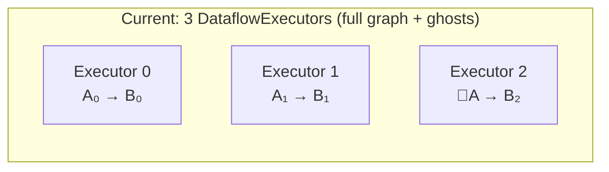

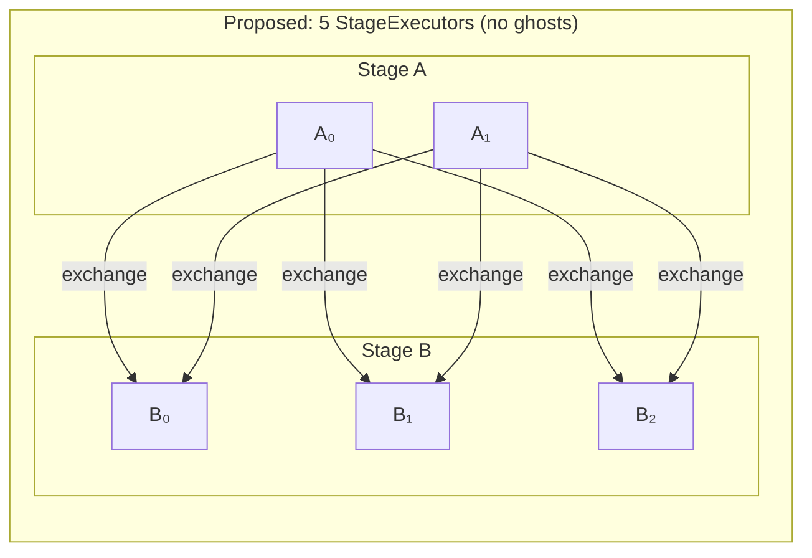

Each StageExecutor:
- Contains only its stage's operators (connected by pipeline channels)
- Has a local progress tracker covering only those operators
- Is independently scheduled on the shared worker thread pool
- Communicates with other stages only through exchange channels

### Exchange Channels Carry Progress

Exchange channels currently carry `(timestamp, data)` batches. They are
extended to also carry **frontier notifications**: capability-change messages
that tell the downstream stage what timestamps the upstream can still produce.

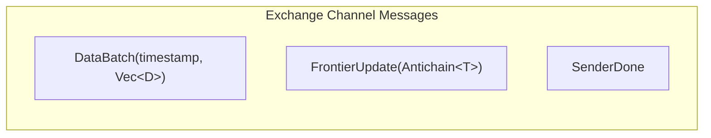

Each exchange channel endpoint aggregates frontiers from all senders:

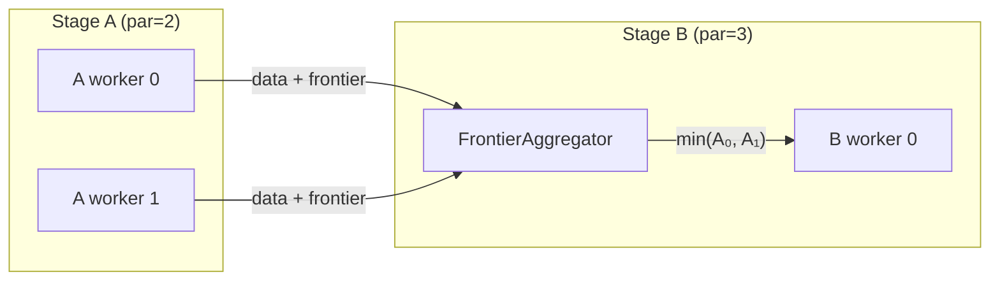

The aggregation is straightforward because the sender count is static (known
at setup time). A `FrontierAggregator` at each receiver tracks per-sender
frontiers and computes the pointwise minimum.

### Progress Tracking

#### Within a Stage (local)

All operators in a stage are connected by pipeline channels within a single
StageExecutor. Progress tracking is purely local — no cross-worker
communication needed.

The local progress tracker maintains a reachability graph for the stage's
operators only. When operator A produces output at time T, the tracker
propagates this through the local graph to compute downstream frontiers.

This is identical to today's per-executor progress tracking, but with a
smaller, self-contained graph.

#### Across Stages (via exchange channels)

When a StageExecutor's output frontier advances (a timestamp becomes
complete), it sends a `FrontierUpdate` on all outgoing exchange channels.
The downstream StageExecutor's `FrontierAggregator` receives updates from
all senders and computes the aggregated input frontier.

The downstream executor treats its exchange input as an external source
with a frontier — similar to how external input ports work today. When the
aggregated frontier advances past time T, the downstream stage knows no
more data at time ≤ T will arrive.

#### Within a Stage, Across Workers

Workers within the same stage process different data partitions
independently. There are no pipeline channels between workers of the same
stage. Each worker's StageExecutor is self-contained.

The stage's "global output frontier" (the minimum across all workers'
output frontiers) is not needed within the stage itself. It's only relevant
to the downstream stage, which receives individual frontier updates from
each upstream worker via their exchange channels. The downstream
`FrontierAggregator` naturally computes `min(all senders)`.

### Feedback Loops

Loops are the critical design challenge. In instancy, `iterate()` creates:

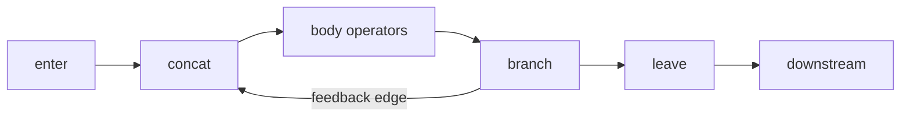

#### Case 1: Loop Without Exchange (all operators in one stage)

The entire loop (enter, concat, body, feedback, leave) lives in a single
stage. The StageExecutor's local progress tracker handles the feedback edge
directly via its reachability graph. The `Product<T, TInner>` timestamp type
coordinates iterations.

**No change from today.** This case works exactly as it does now.

#### Case 2: Loop With Exchange (body spans multiple stages)

If the loop body contains an exchange, the body is split across stages:

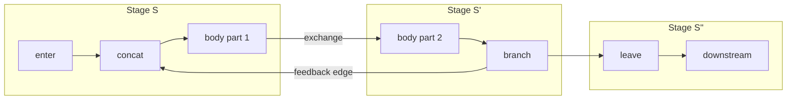

The feedback edge goes from stage S' back to stage S. This creates a
**cross-stage cycle** — data flows S → S' → S (via feedback) → S' → ...

##### Progress in Cross-Stage Loops

The key insight: the feedback operator advances the inner timestamp
(`TInner`) by the loop summary before sending data back. This guarantees
progress — each iteration has a strictly later timestamp than the previous.

For the StageExecutor model:

1. **Feedback as exchange channel:** The feedback edge is a cross-stage
   channel (S' → S) that carries both data and frontier updates, just
   like any other exchange channel. The only difference is it forms a
   cycle in the stage graph.

2. **Iteration frontier tracking:** Stage S's executor tracks its input
   frontier from two sources:
   - The enter channel (from the upstream stage, outside the loop)
   - The feedback channel (from stage S', inside the loop)

   The stage's input frontier = min(enter frontier, feedback frontier).

3. **Termination detection:** An iteration is complete when stage S'
   produces no more feedback data for that iteration's timestamp.
   Stage S' sends a `FrontierUpdate` on the feedback channel when its
   output frontier advances past the iteration timestamp. Stage S then
   knows no more data will arrive for that iteration.

4. **Loop exit:** The `leave` operator only emits data when the inner
   timestamp's frontier has advanced past the data's `TInner` coordinate.
   With StageExecutors, the leave operator's stage receives frontier
   updates from stage S' (the branch/leave stage) indicating when
   iterations are complete.

##### Worked Example

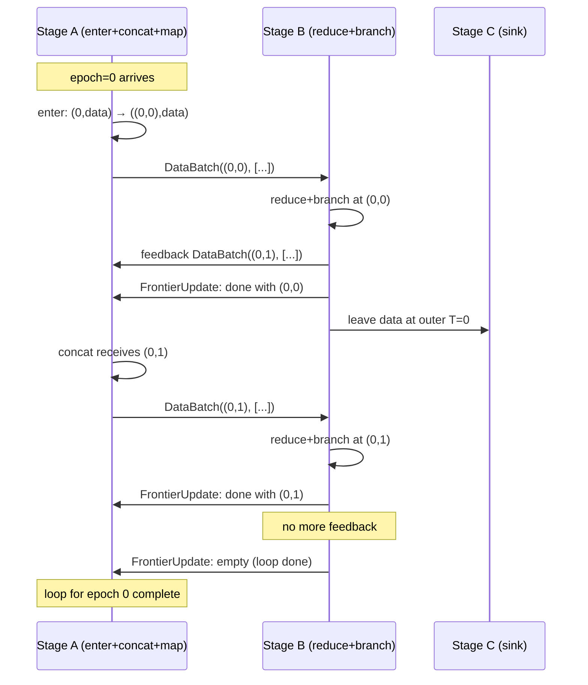

##### Deadlock Prevention

A cross-stage loop could deadlock if:
- Stage S waits for input from the feedback channel
- Stage S' waits for input from the exchange channel from stage S
- Neither can make progress

This cannot happen because:
1. The feedback operator **advances** the timestamp — data at `(e, i)`
   becomes `(e, i+1)`. The inner timestamp strictly increases.
2. Stage S can process data at `(e, i)` even while waiting for feedback
   at `(e, i-1)` — the timestamps are different, so there's no blocking
   dependency.
3. The exchange channel is non-blocking (buffered) — stage S pushes data
   and continues without waiting for stage S' to consume it.

##### Cycle in the Stage DAG

With feedback loops, the stage graph is no longer a DAG — it has cycles.
This is fine because:
- Execution is driven by data availability, not topological order of stages
- Each StageExecutor polls independently on the thread pool
- The timestamp's `Product<T, TInner>` structure ensures logical progress
  even though the stage graph has cycles

#### Case 3: Nested Loops

Nested loops use nested `Product` timestamps: `Product<Product<T, T1>, T2>`.
Each loop level adds an inner timestamp coordinate.

If a nested loop spans stages, it creates multiple feedback channels at
different nesting levels. Each feedback channel carries frontier updates for
its loop level. The StageExecutor aggregates frontiers from all incoming
channels (enter + feedback at each nesting level).

The same principles apply — feedback advances the innermost timestamp,
preventing deadlock. Each nesting level's iteration terminates independently.

#### Case 4: Diamond Topology

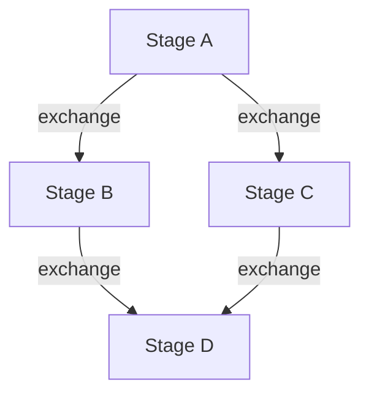

Stage D receives data from both B and C. Its frontier is:
`min(B's frontier via B→D channel, C's frontier via C→D channel)`.

The FrontierAggregator at D tracks all incoming channels independently and
computes the pointwise minimum. This works naturally — no special handling.

#### Case 5: Multiple Exchanges in Sequence

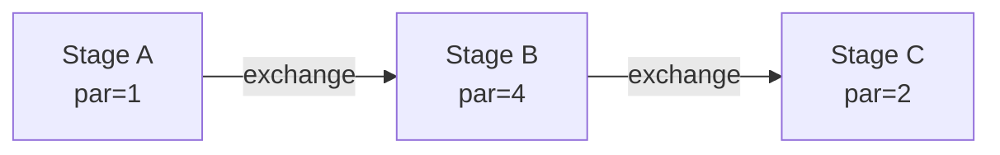

Each exchange boundary is an independent channel with its own frontier
aggregation. Stage B's output frontier feeds into stage C's input frontier.
Progress propagates left-to-right through the chain of exchange channels.

#### Case 6: Subgraph (Loop as a Scoped Region)

A subgraph is a scoped region created by `iterate()`. It introduces a
nested timestamp `Product<T, TInner>` and wraps operators in enter/leave
boundaries. Here are concrete examples.

##### 6a: Self-contained subgraph (no exchange inside loop)

User code:
```rust
input.iterate("pagerank", 0u32, |iter_var| {
    let updated = iter_var.map(|x| x * 2).filter(|x| *x < 100);
    IterateResult { feedback: updated.clone(), output: updated }
});
```

All loop operators land in a single stage:

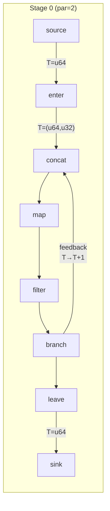

The entire subgraph is inside one StageExecutor. The local progress
tracker handles the feedback edge via its reachability graph. The
`Product<u64, u32>` timestamp coordinates iterations. No cross-stage
communication needed.

##### 6b: Subgraph with exchange inside the loop body

User code:
```rust
input.iterate("distributed_pagerank", 0u32, |iter_var| {
    let updated = iter_var
        .map(|(key, val)| (key, val * 2))
        .exchange(|&(key, _)| key)   // ← exchange inside loop
        .reduce(|key, vals| vals.sum());
    IterateResult { feedback: updated.clone(), output: updated }
});
```

The exchange splits the loop body across two stages:

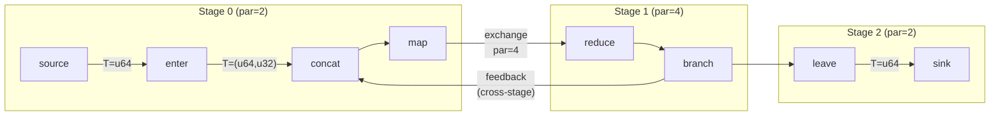

The feedback edge crosses from Stage 1 back to Stage 0. This creates a
cycle in the stage graph. Here's the detailed channel layout:

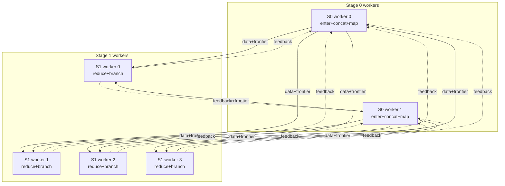

Stage 0 has two exchange input groups:
- **Enter input**: from upstream source (outside the loop)
- **Feedback input**: 4 senders from Stage 1 → aggregated frontier

Stage 0's effective input frontier for the concat operator:
`min(enter_frontier, feedback_aggregate)`.

Iteration trace:

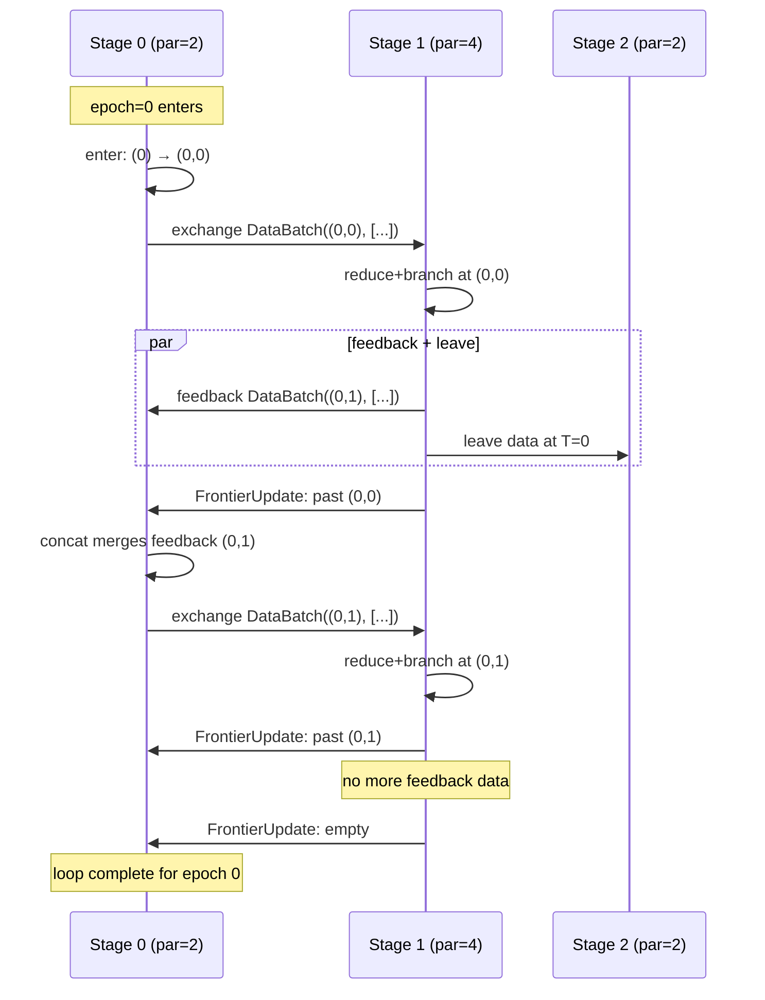

##### 6c: Nested subgraphs (loop inside loop)

User code:
```rust
input.iterate("outer", 0u32, |outer_var| {
    let result = outer_var.iterate("inner", 0u32, |inner_var| {
        let step = inner_var.map(|x| x + 1).filter(|x| *x < 50);
        IterateResult { feedback: step.clone(), output: step }
    });
    IterateResult { feedback: result.clone(), output: result }
});
```

Timestamp type: `Product<Product<u64, u32>, u32>` = `(epoch, outer_iter, inner_iter)`.

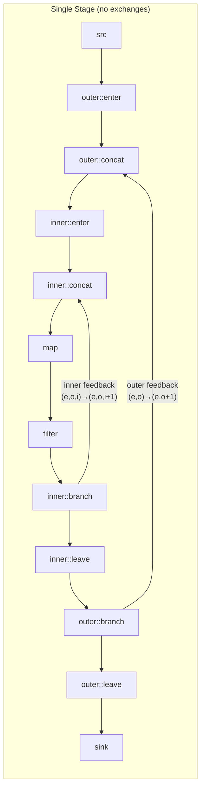

Without exchanges inside either loop, everything stays in one stage.
Each loop level's feedback advances its own coordinate:
- Inner feedback: `(e, o, i) → (e, o, i+1)`
- Outer feedback: `(e, o, _) → (e, o+1, 0)` (inner timestamp resets)

If an exchange were added inside the inner loop, it would split the inner
loop across stages, creating a cross-stage feedback at the inner level —
handled identically to Case 6b but with a deeper timestamp nesting.

### StageExecutor Structure

```rust
struct StageExecutor<T: Timestamp> {
    stage_id: StageId,
    worker_index: usize,

    // Operators and local channels (pipeline within the stage)
    operators: Vec<Box<dyn SchedulableOperator>>,
    local_progress: LocalProgressTracker<T>,

    // Exchange inputs: (channel_id, aggregator)
    // Each aggregator tracks frontiers from all senders on that channel
    exchange_inputs: Vec<ExchangeInputPort<T>>,

    // Exchange outputs: send data + frontier updates to downstream
    exchange_outputs: Vec<ExchangeOutputPort<T>>,

    // Feedback inputs (for loops): same as exchange inputs but form cycles
    feedback_inputs: Vec<ExchangeInputPort<T>>,
}

struct ExchangeInputPort<T: Timestamp> {
    channel_id: usize,
    // One entry per sender — tracks that sender's frontier
    frontier_aggregator: FrontierAggregator<T>,
    // Aggregated frontier (min across all senders)
    current_frontier: Antichain<T>,
}

struct FrontierAggregator<T: Timestamp> {
    // Per-sender frontier state
    sender_frontiers: Vec<Antichain<T>>,
    // Cached aggregate (recomputed when any sender changes)
    aggregate: Antichain<T>,
}
```

### Lifecycle

1. **Build:** User's build closure creates the logical dataflow (unchanged).

2. **Stage inference:** `infer_stages()` groups operators by stage (unchanged).
   Feedback edges that cross stages are identified as cross-stage feedback
   channels.

3. **Channel creation:** For each exchange edge, create M×N channels between
   source and target stages. For feedback edges that cross stages, create
   N'×M channels (target→source direction).

4. **StageExecutor creation:** For each (stage, worker_index), create a
   StageExecutor with:
   - The stage's operator factories (materialized)
   - Local pipeline channel factories (materialized)
   - Exchange input/output port handles
   - A local progress tracker for the stage's operators only

5. **Grouping into CombinedStageExecutor:** All StageExecutors for the same
   worker are collected into a single `CombinedStageExecutor`. This is a
   topology-agnostic container — it has no knowledge of stage identities,
   exchange wiring, or operator logic. Its only responsibilities are:
   - Poll each contained StageExecutor in a loop
   - Drop completed stages immediately (setting the slot to `None`)
   - Complete when all stages are done

   There is exactly **one CombinedStageExecutor per worker**, registered as
   one async task. For example, with Stage A (par=2) and Stage B (par=3)
   across 3 workers:

   ```text
   Worker 0:  CombinedStageExecutor { StageExec(A,0), StageExec(B,0) }
   Worker 1:  CombinedStageExecutor { StageExec(A,1), StageExec(B,1) }
   Worker 2:  CombinedStageExecutor { StageExec(B,2) }  // A's par=2, no A here
   ```

   Dropping a completed stage is critical: it releases the stage's
   operators, channels, and progress tracker immediately, allowing upstream
   or shorter-lived stages to free resources while downstream stages continue
   processing.

6. **Registration:** Each CombinedStageExecutor is registered with the
   worker's task scheduler. Exchange channels are already wired, so stages
   can communicate immediately.

7. **Execution:** The CombinedStageExecutor polls each non-completed
   StageExecutor in a round-robin loop. Each StageExecutor:
   - Pulls data and frontier updates from exchange inputs
   - Updates its local progress tracker
   - Activates local operators in topological order
   - Pushes data to exchange outputs
   - Sends frontier updates when its output frontier advances

8. **Completion:** A StageExecutor completes when all its input frontiers are
   empty (no more data can arrive) and all operators have drained. The
   CombinedStageExecutor completes when all its StageExecutors are done.

### Control Plane: Probes, Completion, and Cancellation

With StageExecutors, each executor sees only its local stage's frontier.
This section covers how probes, completion detection, and cancellation
work without a global frontier view.

#### Probes

A `ProbeHandle` observes the frontier at its insertion point in the graph.
With StageExecutors, the probe operator lives in exactly one stage's
executor. Its frontier is updated by that stage's local progress tracker.

This works correctly because **frontiers propagate transitively**. A probe
at stage C in a pipeline A → B → C reflects A's and B's progress: C's
frontier cannot advance past time T until C has received all data at T,
which requires B to have sent it, which requires A to have produced it.

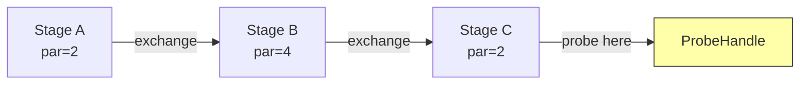

The probe at C shows "all data through T=5 has been fully processed by
the entire pipeline" — not just stage C. No global view needed.

**Multi-worker probes** remain an existing limitation: if stage C has
par=2, two StageExecutors update the same `ProbeHandle`. The frontier
should be `min(C₀, C₁)`. This is the same probe aggregation issue that
exists today (documented as a TODO), not a new problem from StageExecutors.

#### Completion Detection

Today, a single `ProgressTracker` per executor checks `total_counts == 0`
across the full graph (including peer capabilities via broadcast). With
StageExecutors, each executor only knows its own completion.

##### Per-Node Completion

Each node tracks its local StageExecutors with a
**`DataflowCompletionBarrier`**: a shared `AtomicUsize` counter initialized
to the number of StageExecutors on that node.

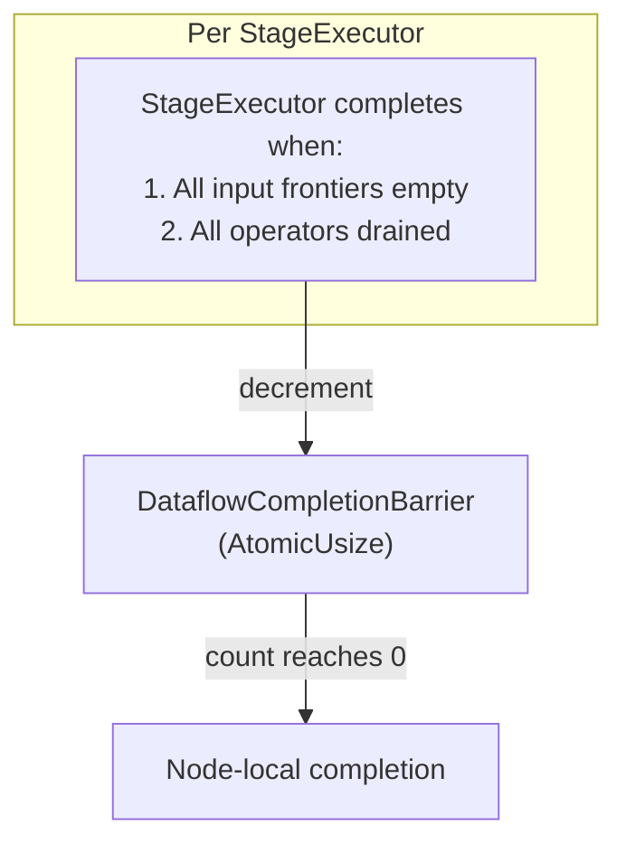

A StageExecutor completes when:
- All exchange inputs have received `SenderDone` from every sender
- All input frontiers are empty (no more timestamps can arrive)
- All local operators have drained (no buffered data)

**Completion cascades naturally through the pipeline:**

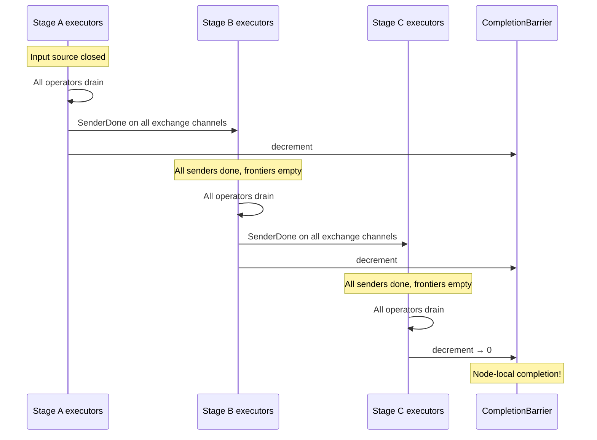

**Feedback loops**: A StageExecutor in a loop cannot complete until the
loop terminates. The feedback channel's frontier must advance to empty
(no more iterations) before the executor's input frontier can become
empty. This happens naturally — when the loop body produces no more
feedback data, the feedback channel's `SenderDone` propagates, and the
loop-stage executor can complete.

##### Cross-Node Completion

In a cluster, **every node calls `spawn()` with the same dataflow
builder** — instancy does not serialize/ship dataflow graphs to remote
nodes. Each node builds and materializes its own subset of StageExecutors
based on stage placement.

Completion is **topology-driven** — no explicit completion broadcast is
needed. The `SenderDone` messages flowing through exchange channels
propagate completion from upstream stages to downstream stages, regardless
of which node they run on:

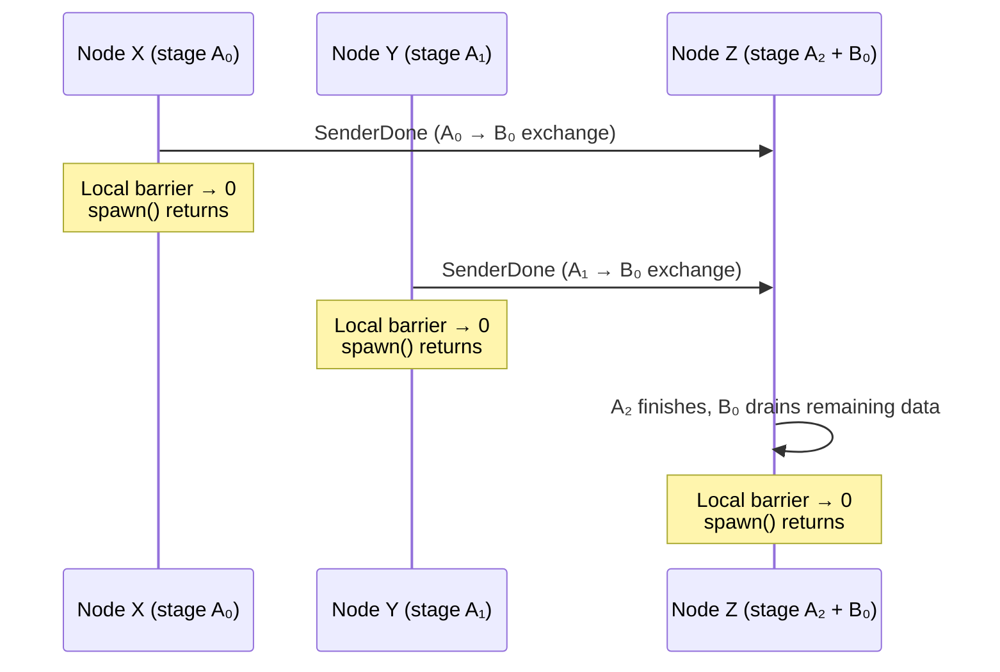

Each node's `spawn()` returns when its local barrier reaches 0.
Nodes running only upstream stages finish first and release resources
immediately — they don't wait for downstream nodes. Downstream nodes
finish naturally when `SenderDone` arrives from all upstream senders.

**No `Complete` control message is needed.** The data channel's
`SenderDone` is the completion signal, flowing through the same exchange
channels as data and frontier updates.

##### Resource Efficiency

This topology-driven model is efficient: nodes release resources as soon
as their local work is done. In a pipeline `A (par=3) → B (par=1)` across
three machines:

- Nodes X and Y (running only stage A workers) finish and free resources
  as soon as they've sent all data
- Node Z (running stage A₂ + stage B₀) finishes last because it runs the
  tail of the pipeline

No node holds resources idle waiting for a global barrier.

##### Interactive / Response Stream Pattern

When a dataflow serves web requests, results must stream back to the
**coordinator node** (the node that accepted the request and holds the
response stream handle). The coordinator's `spawn()` must return last —
otherwise the response stream closes before all results are delivered.

Since all nodes call `spawn()`, and each node's `spawn()` returns when
its local executors finish, the coordinator finishes last only if its
local executors include the **sink stage**. This is ensured by topology:
the user constructs the dataflow so the final fan-in exchange routes
all results back to a single worker, and stage placement ensures that
worker runs on the coordinator:

```rust
// Coordinator node receives request, creates dataflow:
input
    .exchange(hash_key)
    .with_parallelism(cluster_size)     // fan-out to cluster
    .map(|x| expensive_processing(x))
    .exchange(|_| 0)                    // fan-in to single worker
    .with_parallelism(1)                // single worker = coordinator
    .for_each(|record| response_stream.send(record));
```

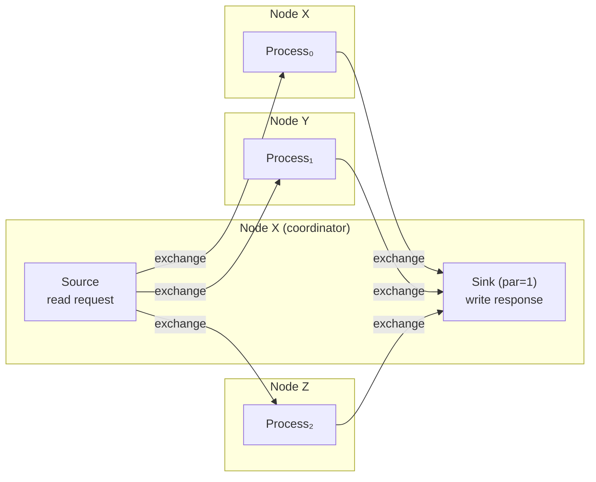

The coordinator's `spawn()` waits for the sink stage to finish,
which is last by construction (it's the pipeline tail receiving
`SenderDone` from all upstream senders). The response stream stays
open until all results have been delivered. Other nodes' `spawn()`
calls return earlier as their upstream stages complete.

##### Batch / Store Pattern

When results are written to an external store (database, S3, etc.), the
sink can run on any node — or even be distributed across nodes. Each
node's `spawn()` returns when its local sink workers finish writing.
The coordinator may finish before all writes complete on other nodes.

If the coordinator needs to confirm all writes are done, it can:
- Use a probe on the final operator (probe frontier reflects global
  completion transitively)
- Add an explicit fan-in exchange to collect acknowledgments

##### Stage Placement

The StageExecutor model enables per-stage placement control. Since each
stage is an independent scheduling unit, the runtime can assign stages
to specific nodes.

When configuring the cluster topology, the user can optionally inform
the dataflow which node should host specific stages — most commonly the
final single-worker collector stage:

```rust
// Cluster topology configuration
let config = ClusterConfig::new()
    .add_node("node-x", addr_x)   // coordinator
    .add_node("node-y", addr_y)
    .add_node("node-z", addr_z)
    .collector_node("node-x");    // optional: single-worker stages
                                  // prefer this node
```

The runtime's stage-to-node assignment logic:
- **Multi-worker stages** (par > 1): distribute workers round-robin
  across all nodes
- **Single-worker stages** (par = 1): assign to the collector node if
  configured, otherwise to the node that initiated the dataflow
- **Future: explicit placement**: `Placement::Node(id)` on individual
  stages for fine-grained control

This is a soft hint, not a hard constraint — the runtime can override
placement if the target node is unavailable. For the response stream
pattern, setting `collector_node` to the coordinator ensures the sink
runs locally and `spawn()` returns only after all results are delivered.

#### Cancellation

Cancellation is orthogonal to progress tracking. It uses a **shared
per-dataflow `CancellationToken`** that all StageExecutors observe.

**Same-process cancellation:**

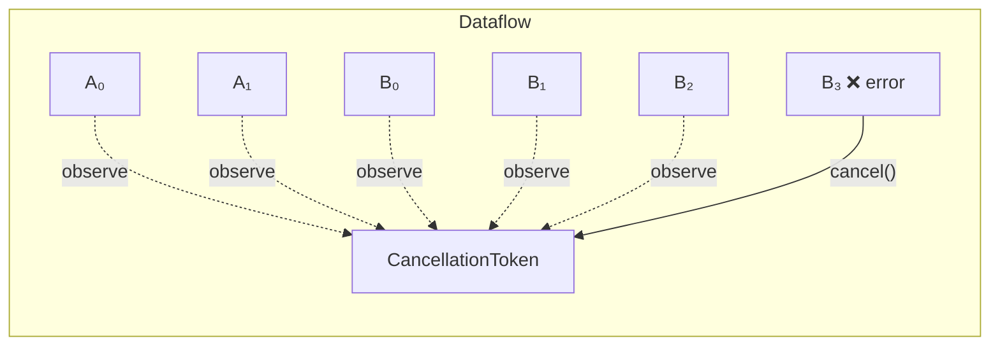

When any StageExecutor encounters an error, it calls `token.cancel()`.
All other executors observe `token.is_cancelled()` on their next poll
and shut down. This works in all directions — downstream failures cancel
upstream, and vice versa.

**Cross-node cancellation:**

```mermaid
sequenceDiagram
    participant B3 as Node B: Stage executor (error)
    participant BT as Node B: CancellationToken
    participant Ctrl as Control Channel (ID 0)
    participant AT as Node A: CancellationToken
    participant AExec as Node A: All executors

    B3->>BT: cancel("operator failed: ...")
    Note over BT: All local executors stop
    BT->>Ctrl: ControlMessage::Cancel { reason }
    Ctrl->>AT: Cancel message received
    AT->>AT: cancel() triggered
    Note over AExec: All remote executors stop
```

Instancy's control protocol already has a `Cancel` message type
(wire format: `[2][reason_len: u32][reason: UTF-8][crc32]`) sent on
control channel ID 0. When a node's `CancellationToken` fires, it
broadcasts `Cancel` to all peer nodes, which trigger their own tokens.

**No changes needed**: The `CancellationToken` + control protocol layer
sits above the executor level. The StageExecutor refactoring does not
affect cancellation — each executor simply holds a `token.clone()`.

#### Summary

| Concern | Mechanism | Global view needed? |
|---|---|---|
| Frontier observation (probe) | Local to stage, transitive | No — transitivity provides it |
| Completion detection | `DataflowCompletionBarrier` (atomic countdown) | No — cascading `SenderDone` + barrier |
| Cancellation | `CancellationToken` + control protocol | No — out-of-band broadcast |

### Migration Path

The StageExecutor model is a significant architectural change. It can be
introduced incrementally:

1. **Phase 1:** Implement `StageExecutor` alongside `DataflowExecutor`.
   Single-stage dataflows (no exchanges) use `StageExecutor` with identical
   behavior to today.

2. **Phase 2:** Multi-stage linear pipelines (no loops). Exchange channels
   carry frontier updates. Test with existing staged parallelism tests.

3. **Phase 3:** Feedback loops. Cross-stage feedback channels with frontier
   propagation. Test with `iterate()` + exchange combinations.

4. **Phase 4:** Remove ghost operator infrastructure from `DataflowExecutor`.
   Remove the separate progress exchange system. `spawn_staged_internal`
   creates StageExecutors directly.

### Frontier Transitivity

A critical simplification: **each stage only aggregates frontiers from its
direct predecessors**, not from all upstream stages.

Consider `A (par=2) → exchange → B (par=4) → exchange → C (par=3)`:

- Stage C receives exchange channels from B's 4 workers → aggregates **4**
  frontiers.
- Stage C does NOT need to know anything about A. B's output frontier
  already reflects A's frontier transitively: B cannot advance its output
  frontier past time T until it has received all data at time ≤T from A.

This means frontier aggregation is always local to adjacent stages. The
`FrontierAggregator` at each exchange input tracks exactly
`source_stage.parallelism` senders — never more.

For diamond topologies where a stage has multiple predecessor stages:

```mermaid
graph LR
    B["B (par=4)"] -->|"4 senders"| D["D (par=2)"]
    C["C (par=3)"] -->|"3 senders"| D
```

Stage D has two exchange inputs and aggregates separately:
- B→D: 4 senders → one aggregated frontier
- C→D: 3 senders → one aggregated frontier

D's effective input frontier = min(B→D aggregate, C→D aggregate).
Total senders tracked: 4 + 3 = 7 (not 4 × 3).

### Ordering Guarantee: Inline Watermarks on FIFO Channels

This design requires per-channel FIFO ordering — a `FrontierUpdate` for
time T must arrive after all `DataBatch` messages at time ≤ T on the same
channel.

**In-process channels** (bounded queues) are FIFO by construction.

**Cross-process channels** use instancy's shared connection pool, where a
single logical stream `(dataflow_id, channel_id)` may be multiplexed across
multiple TCP connections. TCP guarantees FIFO within a single connection,
but when frames travel over **different** connections, network-level FIFO
is broken. Instancy's messaging layer restores ordering:

1. **SequenceCounter**: Each logical stream stamps every frame with a
   monotonically increasing `u64` sequence ID.
2. **ReorderBuffer**: At the receiver, per logical stream. Delivers
   in-order frames immediately, buffers out-of-order arrivals in a
   `BTreeMap<seq_id, payload>`, and times out if a gap persists.

```mermaid
sequenceDiagram
    participant S as Sender
    participant P as Connection Pool
    participant R as ReorderBuffer

    S->>P: Frame(seq=0, DataBatch T=5)
    S->>P: Frame(seq=1, DataBatch T=5)
    S->>P: Frame(seq=2, FrontierUpdate past T=5)
    Note over P: Frames may travel over<br/>different TCP connections
    P->>R: Frame(seq=2) arrives first!
    Note over R: seq=2 buffered (gap: need 0,1)
    P->>R: Frame(seq=0) arrives
    Note over R: seq=0 delivered immediately
    P->>R: Frame(seq=1) arrives
    Note over R: seq=1 delivered, then seq=2<br/>All in original order ✓
```

This means the inline watermark model works correctly over the network —
the `FrontierUpdate` is guaranteed to be delivered after all preceding
`DataBatch` messages on the same logical stream, regardless of how many
TCP connections carry the frames.

```mermaid
sequenceDiagram
    participant S as Sender (Stage A, worker 0)
    participant Ch as FIFO Channel
    participant R as Receiver (Stage B, worker 0)

    S->>Ch: DataBatch(T=5, [a,b,c])
    S->>Ch: DataBatch(T=5, [d,e])
    S->>Ch: FrontierUpdate(past T=5)
    Note over Ch: FIFO order preserved
    Ch->>R: DataBatch(T=5, [a,b,c])
    Ch->>R: DataBatch(T=5, [d,e])
    Ch->>R: FrontierUpdate(past T=5)
    Note over R: All T=5 data received<br/>before frontier advances
```

By contrast, timely uses separate channels for data and progress.
To prevent premature frontier advance, the exchange operator holds
a **capability counter** for in-flight data:

```mermaid
sequenceDiagram
    participant Op as Operator A
    participant Ex as Exchange Operator
    participant PC as Progress Channel
    participant DC as Data Channel
    participant B as Operator B

    Op->>Ex: push DataBatch(T=5)
    Note over Ex: acquires cap(T=5, +1)
    Op->>Op: drop Capability(T=5)
    Note over Op: reports (A, T=5, -1)

    par Broadcast atomically
        Op->>PC: [(A,T=5,-1), (Ex,T=5,+1)]
    and Send data
        Ex->>DC: DataBatch(T=5)
    end

    Note over B: Progress arrives first!
    PC->>B: [(A,T=5,-1), (Ex,T=5,+1)]
    Note over B: Net: Ex still holds cap<br/>→ frontier stays at T=5 ✓

    DC->>B: DataBatch(T=5) arrives
    Ex->>PC: [(Ex,T=5,-1)]
    PC->>B: [(Ex,T=5,-1)]
    Note over B: Net: 0 caps at T=5<br/>→ frontier advances past T=5 ✓
```

### Comparison with Current Design

| Aspect | Current (DataflowExecutor) | Proposed (StageExecutor) |
|--------|---------------------------|-------------------------|
| Executors per dataflow | max(P_i) | sum(P_i) |
| Graph per executor | Full (with ghosts) | Stage only |
| Progress exchange | All-to-all broadcast (separate channel) | Inline via exchange channels |
| Ghost operators | Required for non-participating stages | Not needed |
| Loop handling | Single reachability graph | Cross-stage feedback channels |
| Scheduling | One executor polls all stages | Independent per-stage scheduling |
| Progress message complexity | O(N²) per round (N = max parallelism) | O(M×N) per exchange edge |

### Why Inline Watermarks Over Broadcast Counting

Timely-dataflow uses **all-to-all broadcast + pointstamp counting** for
progress tracking. This section compares the two approaches and explains
why we choose inline watermarks for instancy's per-stage dynamic parallelism.

#### Timely's Broadcast + Counting

Every worker holds the **full dataflow graph** and broadcasts `(operator,
port, timestamp, ±1)` capability deltas to all N-1 peers. Each worker's
reachability tracker maintains a global picture of all capabilities across
all workers.

**Pros:**

- **Order-independent**: Capability deltas are additive integers. Messages
  from different workers can arrive in any order — `(+1, -1)` and `(-1, +1)`
  both produce net 0. Only per-sender FIFO is needed (to avoid observing a
  drop before an acquire from the same worker).

- **Global visibility**: Every worker knows every other worker's capabilities.
  This enables global optimization decisions and makes completion detection
  straightforward — the dataflow is done when `total_counts == 0`.

- **Proven correctness**: Timely's progress protocol has been formally
  reasoned about and battle-tested in production systems (Naiad, Differential
  Dataflow).

**Cons:**

- **O(N²) message complexity**: Each worker broadcasts to N-1 peers every
  propagation round. For a dataflow with `max_parallelism = 64`, that's
  ~4000 progress messages per round, even if most stages have lower
  parallelism.

- **Ghost operators required for dynamic parallelism**: When stages have
  different parallelism (e.g., stage A par=2, stage B par=8), workers that
  don't participate in a stage need ghost operators — placeholder nodes in
  the reachability graph that ensure peer progress updates propagate
  correctly across stage boundaries. This adds complexity:
  - Ghost operators have shapes but no capabilities or progress buffers
  - The reachability graph is larger than necessary (full graph × max workers)
  - `mark_ghost_operators()` must carefully strip capabilities without
    breaking graph connectivity

- **All workers coupled**: Every worker must process every other worker's
  progress updates, even for stages it doesn't participate in. A slow
  worker in stage C delays progress visibility in unrelated stage A.

- **Separate progress channel**: Requires a dedicated N×(N-1) channel
  infrastructure parallel to the data channels. For cross-node clusters,
  this means additional TCP connections or multiplexed streams solely for
  progress.

#### Inline Watermarks (Proposed)

Each exchange channel carries `FrontierUpdate` messages inline with data.
Progress information flows through the same channels as data, in FIFO
order. Each StageExecutor tracks only its local operators' progress and
aggregates input frontiers from its direct predecessor stages.

**Pros:**

- **Natural fit for dynamic parallelism**: Each stage is self-contained.
  Stage A (par=2) and stage B (par=8) create 2 + 8 = 10 StageExecutors,
  each with a minimal local graph. No ghost operators, no wasted work.

- **O(M×N) message complexity per exchange**: Between two adjacent stages
  with parallelism M and N, there are M×N channels, each carrying its own
  frontier updates. Total progress messages = number of exchange channels,
  not number of workers squared.

- **Local reasoning**: Each StageExecutor only needs to know about its
  direct predecessors' frontiers. No global graph, no tracking capabilities
  of unrelated stages. Simpler to reason about correctness.

- **No separate progress infrastructure**: Progress reuses the data channel
  — no additional channels, connections, or bridge tasks needed. Reduces
  transport complexity.

- **Independent scheduling**: Stages are decoupled. A slow stage C doesn't
  affect progress tracking in stage A — stage A's output frontier advances
  as soon as its own operators complete, regardless of downstream.

- **Simpler implementation**: No `SubgraphBuilder::mark_ghost_operators()`,
  no `WorkerProgressChannels`, no `broadcast_local_changes()` /
  `receive_peer_changes()`. The `FrontierAggregator` is a simple
  `min(per_sender_frontiers)` computation.

**Cons:**

- **Requires FIFO channels**: Frontier updates must arrive after all
  preceding data on the same channel. In-process queues and TCP provide
  this natively. For pooled connections where frames may travel over
  different TCP connections, instancy's `SequenceCounter` +
  `ReorderBuffer` restores ordering (already implemented).

- **No global visibility**: A StageExecutor doesn't know about stages
  beyond its direct predecessors/successors. Global completion detection
  requires coordination across all StageExecutors (e.g., all executors
  report "done" to a central coordinator or through cascading completion
  signals).

- **Frontier latency through deep pipelines**: In a chain of N stages,
  a frontier advance at stage 1 must propagate through stages 2, 3, ..., N
  sequentially. Timely's broadcast delivers to all workers simultaneously.
  However, this is rarely a bottleneck — data must also travel through the
  pipeline, so frontier latency tracks data latency.

- **Cross-stage loops add complexity**: Feedback edges that cross stages
  create cycles in the stage graph. The inline model handles this via
  cross-stage feedback channels (same mechanism as forward exchange), but
  reasoning about termination in cyclic stage graphs requires care.

#### Why Watermarks for Instancy

The decisive factor is **dynamic per-stage parallelism**. Instancy's design
goal is that each stage independently chooses its parallelism:

```
source (par=1) → parse (par=4) → exchange → aggregate (par=2) → sink (par=1)
```

With broadcast counting, this requires `max(1,4,2,1) = 4` executors, where
3 of them carry ghost operators for stages they don't participate in. The
ghost operator complexity grows with the number of stages and the variance
in parallelism.

```mermaid
graph TD
    subgraph "Broadcast counting: 4 executors × full graph"
        E0["Executor 0: src → parse → agg → sink"]
        E1["Executor 1: 👻src → parse → agg → sink"]
        E2["Executor 2: 👻src → parse → 👻agg → 👻sink"]
        E3["Executor 3: 👻src → parse → 👻agg → 👻sink"]
    end
```

```mermaid
graph TD
    subgraph "Inline watermarks: 8 StageExecutors, no ghosts"
        subgraph "Stage: source (par=1)"
            S0["src₀"]
        end
        subgraph "Stage: parse (par=4)"
            P0["parse₀"]
            P1["parse₁"]
            P2["parse₂"]
            P3["parse₃"]
        end
        subgraph "Stage: aggregate (par=2)"
            A0["agg₀"]
            A1["agg₁"]
        end
        subgraph "Stage: sink (par=1)"
            K0["sink₀"]
        end
        S0 --> P0
        S0 --> P1
        S0 --> P2
        S0 --> P3
        P0 --> A0
        P0 --> A1
        P1 --> A0
        P1 --> A1
        P2 --> A0
        P2 --> A1
        P3 --> A0
        P3 --> A1
        A0 --> K0
        A1 --> K0
    end
```

With inline watermarks, each executor is minimal and self-contained.
The total work scales with `sum(parallelisms)` not `stages × max(parallelism)`.
For production dataflows with many stages at varying parallelism, this
eliminates significant wasted computation in ghost operator progress
tracking.

