# Stage Executor Design

## Problem

The current `DataflowExecutor` spans all stages of a dataflow. For a dataflow
with stages A (par=2) and B (par=3), the runtime creates `max(2, 3) = 3`
executors, each containing the full graph. Non-participating operators become
"ghost operators" in the progress tracker — a complexity inherited from
timely-dataflow's all-to-all progress broadcast model.

This design proposes replacing the single cross-stage executor with per-stage
**StageExecutors**, where each executor covers exactly one stage's operators.
Progress flows inline with data through exchange channels, eliminating ghost
operators and the separate progress exchange system.

## Design

### Core Idea

Instead of one `DataflowExecutor` per global worker, create one
`StageExecutor` per (stage, worker_index) pair:

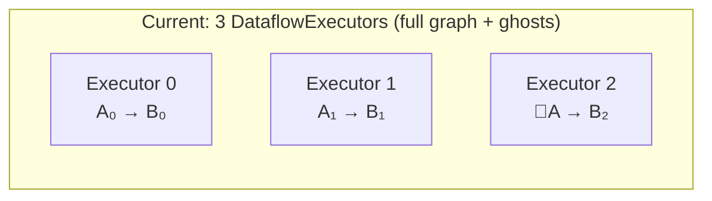

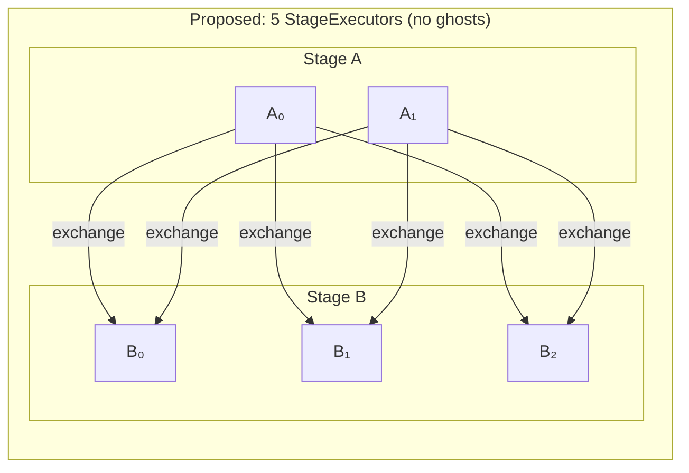

Each StageExecutor:
- Contains only its stage's operators (connected by pipeline channels)
- Has a local progress tracker covering only those operators
- Is independently scheduled on the shared worker thread pool
- Communicates with other stages only through exchange channels

### Exchange Channels Carry Progress

Exchange channels currently carry `(timestamp, data)` batches. They are
extended to also carry **frontier notifications**: capability-change messages
that tell the downstream stage what timestamps the upstream can still produce.

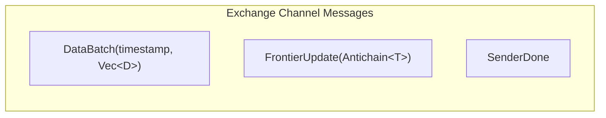

Each exchange channel endpoint aggregates frontiers from all senders:

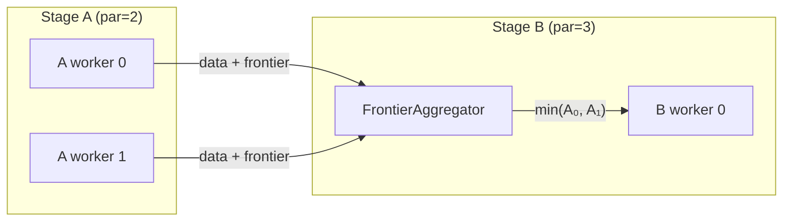

The aggregation is straightforward because the sender count is static (known
at setup time). A `FrontierAggregator` at each receiver tracks per-sender
frontiers and computes the pointwise minimum.

### Progress Tracking

#### Within a Stage (local)

All operators in a stage are connected by pipeline channels within a single
StageExecutor. Progress tracking is purely local — no cross-worker
communication needed.

The local progress tracker maintains a reachability graph for the stage's
operators only. When operator A produces output at time T, the tracker
propagates this through the local graph to compute downstream frontiers.

This is identical to today's per-executor progress tracking, but with a
smaller, self-contained graph.

#### Across Stages (via exchange channels)

When a StageExecutor's output frontier advances (a timestamp becomes
complete), it sends a `FrontierUpdate` on all outgoing exchange channels.
The downstream StageExecutor's `FrontierAggregator` receives updates from
all senders and computes the aggregated input frontier.

The downstream executor treats its exchange input as an external source
with a frontier — similar to how external input ports work today. When the
aggregated frontier advances past time T, the downstream stage knows no
more data at time ≤ T will arrive.

#### Within a Stage, Across Workers

Workers within the same stage process different data partitions
independently. There are no pipeline channels between workers of the same
stage. Each worker's StageExecutor is self-contained.

The stage's "global output frontier" (the minimum across all workers'
output frontiers) is not needed within the stage itself. It's only relevant
to the downstream stage, which receives individual frontier updates from
each upstream worker via their exchange channels. The downstream
`FrontierAggregator` naturally computes `min(all senders)`.

### Feedback Loops

Loops are the critical design challenge. In instancy, `iterate()` creates:

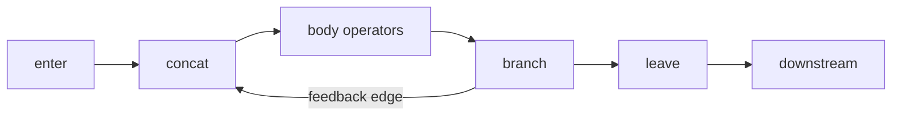

#### Case 1: Loop Without Exchange (all operators in one stage)

The entire loop (enter, concat, body, feedback, leave) lives in a single
stage. The StageExecutor's local progress tracker handles the feedback edge
directly via its reachability graph. The `Product<T, TInner>` timestamp type
coordinates iterations.

**No change from today.** This case works exactly as it does now.

#### Case 2: Loop With Exchange (body spans multiple stages)

If the loop body contains an exchange, the body is split across stages:

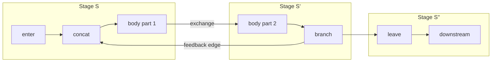

The feedback edge goes from stage S' back to stage S. This creates a
**cross-stage cycle** — data flows S → S' → S (via feedback) → S' → ...

##### Progress in Cross-Stage Loops

The key insight: the feedback operator advances the inner timestamp
(`TInner`) by the loop summary before sending data back. This guarantees
progress — each iteration has a strictly later timestamp than the previous.

For the StageExecutor model:

1. **Feedback as exchange channel:** The feedback edge is a cross-stage
   channel (S' → S) that carries both data and frontier updates, just
   like any other exchange channel. The only difference is it forms a
   cycle in the stage graph.

2. **Iteration frontier tracking:** Stage S's executor tracks its input
   frontier from two sources:
   - The enter channel (from the upstream stage, outside the loop)
   - The feedback channel (from stage S', inside the loop)

   The stage's input frontier = min(enter frontier, feedback frontier).

3. **Termination detection:** An iteration is complete when stage S'
   produces no more feedback data for that iteration's timestamp.
   Stage S' sends a `FrontierUpdate` on the feedback channel when its
   output frontier advances past the iteration timestamp. Stage S then
   knows no more data will arrive for that iteration.

4. **Loop exit:** The `leave` operator only emits data when the inner
   timestamp's frontier has advanced past the data's `TInner` coordinate.
   With StageExecutors, the leave operator's stage receives frontier
   updates from stage S' (the branch/leave stage) indicating when
   iterations are complete.

##### Worked Example

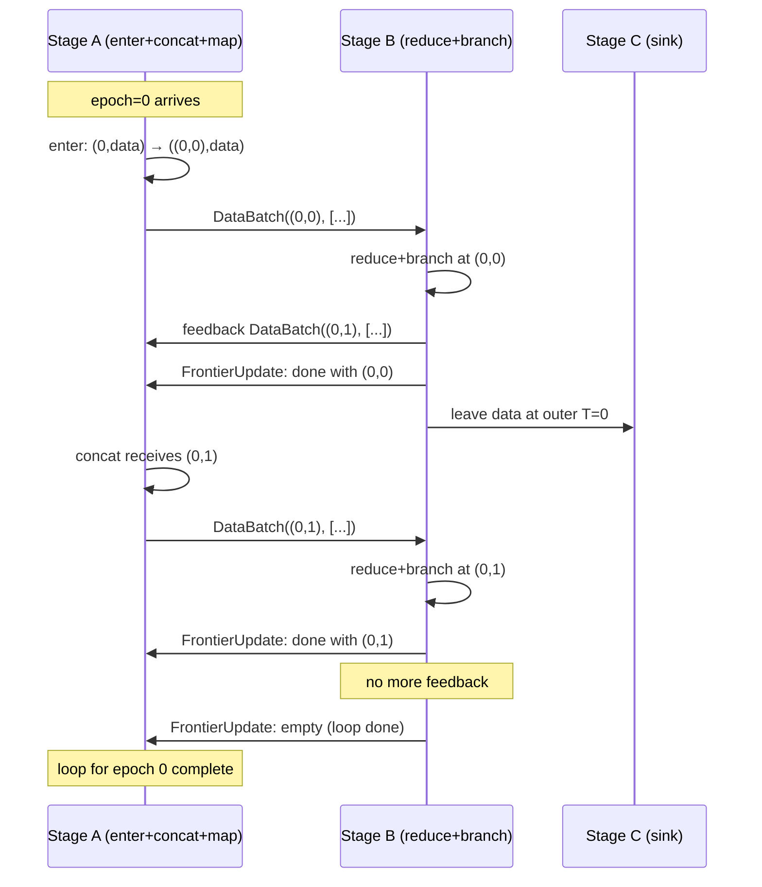

##### Deadlock Prevention

A cross-stage loop could deadlock if:
- Stage S waits for input from the feedback channel
- Stage S' waits for input from the exchange channel from stage S
- Neither can make progress

This cannot happen because:
1. The feedback operator **advances** the timestamp — data at `(e, i)`
   becomes `(e, i+1)`. The inner timestamp strictly increases.
2. Stage S can process data at `(e, i)` even while waiting for feedback
   at `(e, i-1)` — the timestamps are different, so there's no blocking
   dependency.
3. The exchange channel is non-blocking (buffered) — stage S pushes data
   and continues without waiting for stage S' to consume it.

##### Cycle in the Stage DAG

With feedback loops, the stage graph is no longer a DAG — it has cycles.
This is fine because:
- Execution is driven by data availability, not topological order of stages
- Each StageExecutor polls independently on the thread pool
- The timestamp's `Product<T, TInner>` structure ensures logical progress
  even though the stage graph has cycles

#### Case 3: Nested Loops

Nested loops use nested `Product` timestamps: `Product<Product<T, T1>, T2>`.
Each loop level adds an inner timestamp coordinate.

If a nested loop spans stages, it creates multiple feedback channels at
different nesting levels. Each feedback channel carries frontier updates for
its loop level. The StageExecutor aggregates frontiers from all incoming
channels (enter + feedback at each nesting level).

The same principles apply — feedback advances the innermost timestamp,
preventing deadlock. Each nesting level's iteration terminates independently.

#### Case 4: Diamond Topology

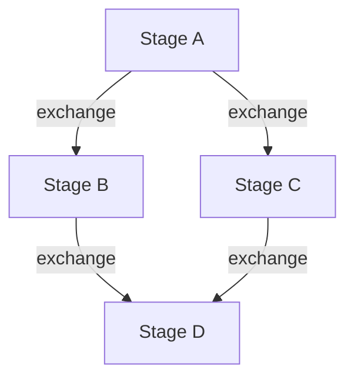

Stage D receives data from both B and C. Its frontier is:
`min(B's frontier via B→D channel, C's frontier via C→D channel)`.

The FrontierAggregator at D tracks all incoming channels independently and
computes the pointwise minimum. This works naturally — no special handling.

#### Case 5: Multiple Exchanges in Sequence

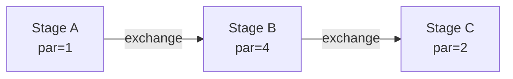

Each exchange boundary is an independent channel with its own frontier
aggregation. Stage B's output frontier feeds into stage C's input frontier.
Progress propagates left-to-right through the chain of exchange channels.

#### Case 6: Subgraph (Loop as a Scoped Region)

A subgraph is a scoped region created by `iterate()`. It introduces a
nested timestamp `Product<T, TInner>` and wraps operators in enter/leave
boundaries. Here are concrete examples.

##### 6a: Self-contained subgraph (no exchange inside loop)

User code:
```rust
input.iterate("pagerank", 0u32, |iter_var| {
    let updated = iter_var.map(|x| x * 2).filter(|x| *x < 100);
    IterateResult { feedback: updated.clone(), output: updated }
});
```

All loop operators land in a single stage:

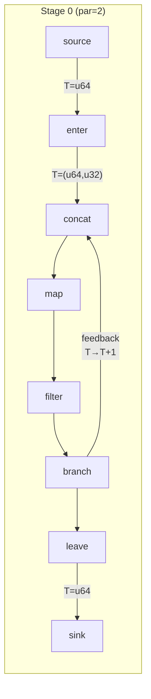

The entire subgraph is inside one StageExecutor. The local progress
tracker handles the feedback edge via its reachability graph. The
`Product<u64, u32>` timestamp coordinates iterations. No cross-stage
communication needed.

##### 6b: Subgraph with exchange inside the loop body

User code:
```rust
input.iterate("distributed_pagerank", 0u32, |iter_var| {
    let updated = iter_var
        .map(|(key, val)| (key, val * 2))
        .exchange(|&(key, _)| key)   // ← exchange inside loop
        .reduce(|key, vals| vals.sum());
    IterateResult { feedback: updated.clone(), output: updated }
});
```

The exchange splits the loop body across two stages:

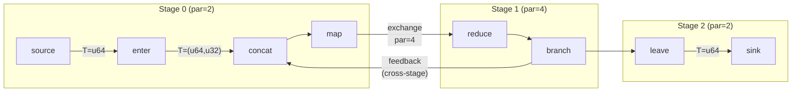

The feedback edge crosses from Stage 1 back to Stage 0. This creates a
cycle in the stage graph. Here's the detailed channel layout:

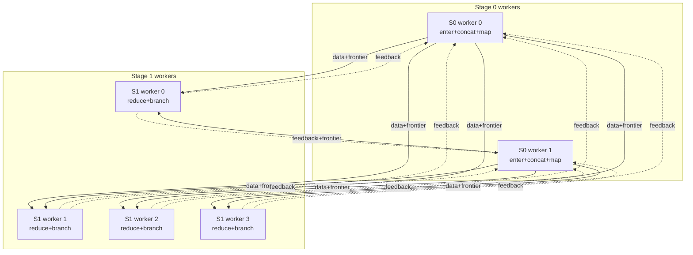

Stage 0 has two exchange input groups:
- **Enter input**: from upstream source (outside the loop)
- **Feedback input**: 4 senders from Stage 1 → aggregated frontier

Stage 0's effective input frontier for the concat operator:
`min(enter_frontier, feedback_aggregate)`.

Iteration trace:

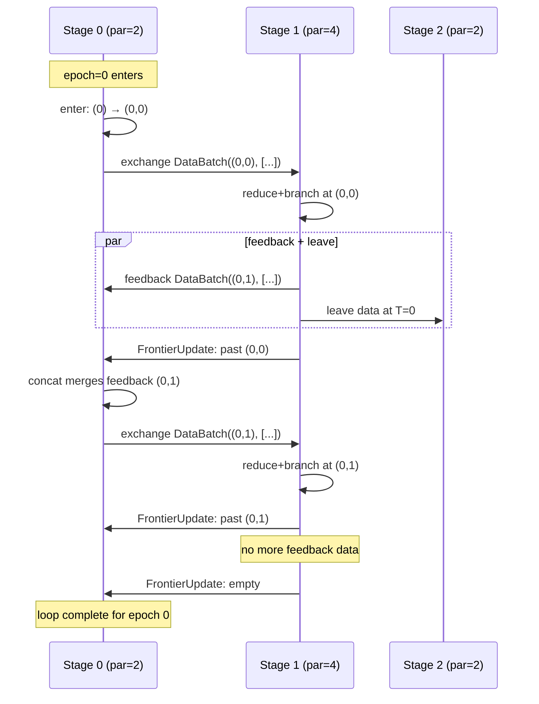

##### 6c: Nested subgraphs (loop inside loop)

User code:
```rust
input.iterate("outer", 0u32, |outer_var| {
    let result = outer_var.iterate("inner", 0u32, |inner_var| {
        let step = inner_var.map(|x| x + 1).filter(|x| *x < 50);
        IterateResult { feedback: step.clone(), output: step }
    });
    IterateResult { feedback: result.clone(), output: result }
});
```

Timestamp type: `Product<Product<u64, u32>, u32>` = `(epoch, outer_iter, inner_iter)`.

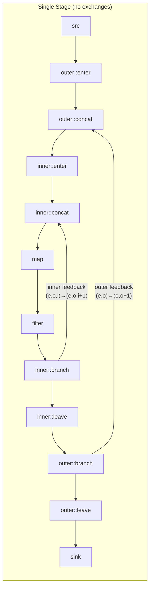

Without exchanges inside either loop, everything stays in one stage.
Each loop level's feedback advances its own coordinate:
- Inner feedback: `(e, o, i) → (e, o, i+1)`
- Outer feedback: `(e, o, _) → (e, o+1, 0)` (inner timestamp resets)

If an exchange were added inside the inner loop, it would split the inner
loop across stages, creating a cross-stage feedback at the inner level —
handled identically to Case 6b but with a deeper timestamp nesting.

### StageExecutor Structure

```rust
struct StageExecutor<T: Timestamp> {
    stage_id: StageId,
    worker_index: usize,

    // Operators and local channels (pipeline within the stage)
    operators: Vec<Box<dyn SchedulableOperator>>,
    local_progress: LocalProgressTracker<T>,

    // Exchange inputs: (channel_id, aggregator)
    // Each aggregator tracks frontiers from all senders on that channel
    exchange_inputs: Vec<ExchangeInputPort<T>>,

    // Exchange outputs: send data + frontier updates to downstream
    exchange_outputs: Vec<ExchangeOutputPort<T>>,

    // Feedback inputs (for loops): same as exchange inputs but form cycles
    feedback_inputs: Vec<ExchangeInputPort<T>>,
}

struct ExchangeInputPort<T: Timestamp> {
    channel_id: usize,
    // One entry per sender — tracks that sender's frontier
    frontier_aggregator: FrontierAggregator<T>,
    // Aggregated frontier (min across all senders)
    current_frontier: Antichain<T>,
}

struct FrontierAggregator<T: Timestamp> {
    // Per-sender frontier state
    sender_frontiers: Vec<Antichain<T>>,
    // Cached aggregate (recomputed when any sender changes)
    aggregate: Antichain<T>,
}
```

### Lifecycle

1. **Build:** User's build closure creates the logical dataflow (unchanged).

2. **Stage inference:** `infer_stages()` groups operators by stage (unchanged).
   Feedback edges that cross stages are identified as cross-stage feedback
   channels.

3. **Channel creation:** For each exchange edge, create M×N channels between
   source and target stages. For feedback edges that cross stages, create
   N'×M channels (target→source direction).

4. **StageExecutor creation:** For each (stage, worker_index), create a
   StageExecutor with:
   - The stage's operator factories (materialized)
   - Local pipeline channel factories (materialized)
   - Exchange input/output port handles
   - A local progress tracker for the stage's operators only

5. **Registration:** All StageExecutors are registered with the worker thread
   pool. They are polled independently.

6. **Execution:** Each StageExecutor:
   - Pulls data from exchange inputs (data batches + frontier updates)
   - Activates local operators in topological order
   - Pushes data to exchange outputs
   - Sends frontier updates when its output frontier advances

7. **Completion:** A StageExecutor completes when all its input frontiers are
   empty (no more data can arrive) and all operators have drained.

### Control Plane: Probes, Completion, and Cancellation

With StageExecutors, each executor sees only its local stage's frontier.
This section covers how probes, completion detection, and cancellation
work without a global frontier view.

#### Probes

A `ProbeHandle` observes the frontier at its insertion point in the graph.
With StageExecutors, the probe operator lives in exactly one stage's
executor. Its frontier is updated by that stage's local progress tracker.

This works correctly because **frontiers propagate transitively**. A probe
at stage C in a pipeline A → B → C reflects A's and B's progress: C's
frontier cannot advance past time T until C has received all data at T,
which requires B to have sent it, which requires A to have produced it.

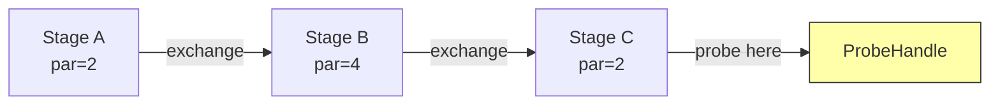

The probe at C shows "all data through T=5 has been fully processed by
the entire pipeline" — not just stage C. No global view needed.

**Multi-worker probes** remain an existing limitation: if stage C has
par=2, two StageExecutors update the same `ProbeHandle`. The frontier
should be `min(C₀, C₁)`. This is the same probe aggregation issue that
exists today (documented as a TODO), not a new problem from StageExecutors.

#### Completion Detection

Today, a single `ProgressTracker` per executor checks `total_counts == 0`
across the full graph (including peer capabilities via broadcast). With
StageExecutors, each executor only knows its own completion.

##### Per-Node Completion

Each node tracks its local StageExecutors with a
**`DataflowCompletionBarrier`**: a shared `AtomicUsize` counter initialized
to the number of StageExecutors on that node.

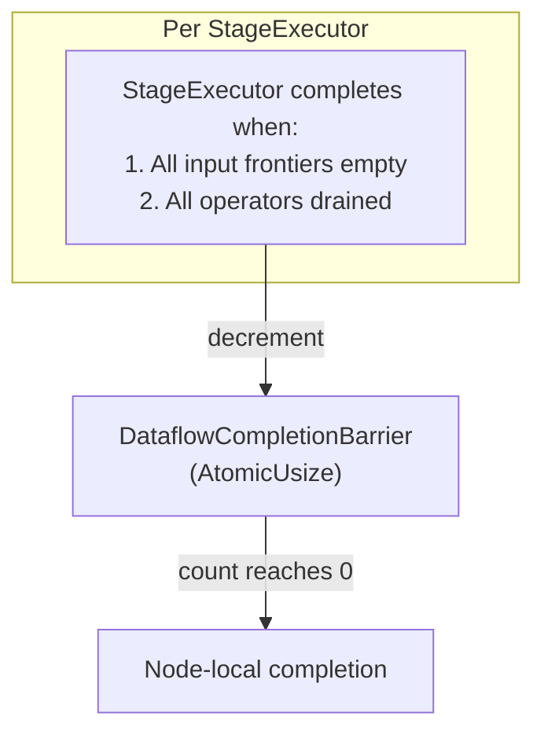

A StageExecutor completes when:
- All exchange inputs have received `SenderDone` from every sender
- All input frontiers are empty (no more timestamps can arrive)
- All local operators have drained (no buffered data)

**Completion cascades naturally through the pipeline:**

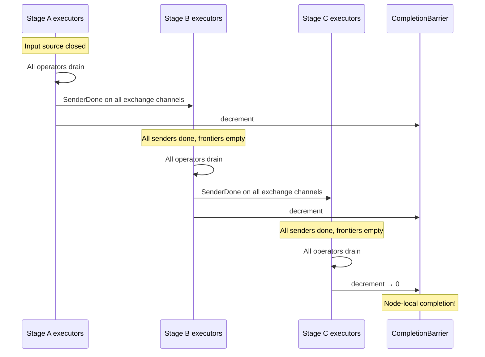

**Feedback loops**: A StageExecutor in a loop cannot complete until the
loop terminates. The feedback channel's frontier must advance to empty
(no more iterations) before the executor's input frontier can become
empty. This happens naturally — when the loop body produces no more
feedback data, the feedback channel's `SenderDone` propagates, and the
loop-stage executor can complete.

##### Cross-Node Completion

In a cluster, **every node calls `spawn()` with the same dataflow
builder** — instancy does not serialize/ship dataflow graphs to remote
nodes. Each node builds and materializes its own subset of StageExecutors
based on stage placement.

Completion is **topology-driven** — no explicit completion broadcast is
needed. The `SenderDone` messages flowing through exchange channels
propagate completion from upstream stages to downstream stages, regardless
of which node they run on:

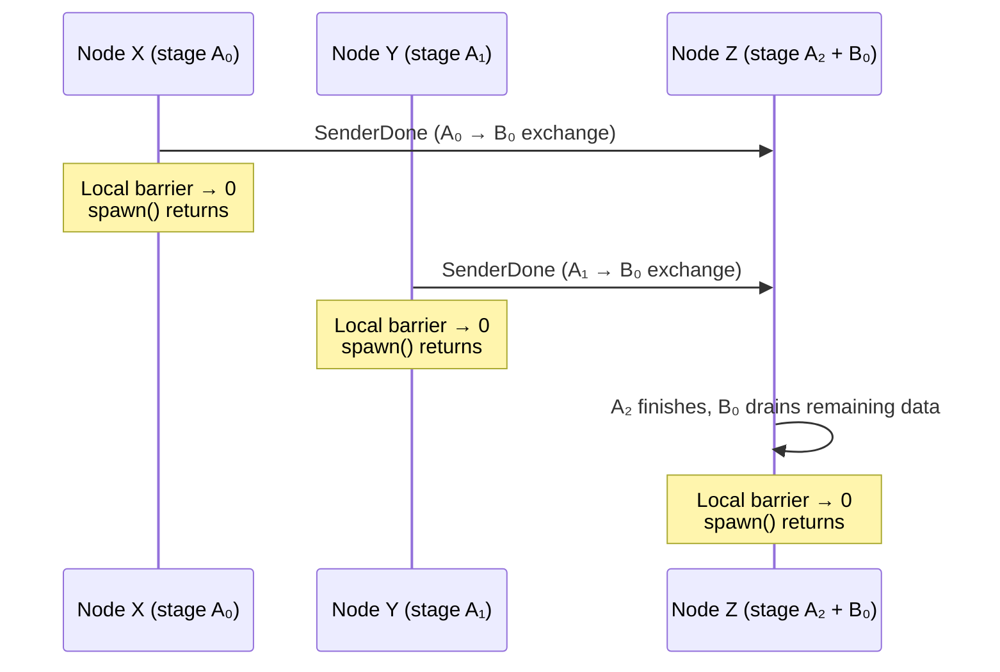

Each node's `spawn()` returns when its local barrier reaches 0.
Nodes running only upstream stages finish first and release resources
immediately — they don't wait for downstream nodes. Downstream nodes
finish naturally when `SenderDone` arrives from all upstream senders.

**No `Complete` control message is needed.** The data channel's
`SenderDone` is the completion signal, flowing through the same exchange
channels as data and frontier updates.

##### Resource Efficiency

This topology-driven model is efficient: nodes release resources as soon
as their local work is done. In a pipeline `A (par=3) → B (par=1)` across
three machines:

- Nodes X and Y (running only stage A workers) finish and free resources
  as soon as they've sent all data
- Node Z (running stage A₂ + stage B₀) finishes last because it runs the
  tail of the pipeline

No node holds resources idle waiting for a global barrier.

##### Interactive / Response Stream Pattern

When a dataflow serves web requests, results must stream back to the
**coordinator node** (the node that accepted the request and holds the
response stream handle). The coordinator's `spawn()` must return last —
otherwise the response stream closes before all results are delivered.

Since all nodes call `spawn()`, and each node's `spawn()` returns when
its local executors finish, the coordinator finishes last only if its
local executors include the **sink stage**. This is ensured by topology:
the user constructs the dataflow so the final fan-in exchange routes
all results back to a single worker, and stage placement ensures that
worker runs on the coordinator:

```rust
// Coordinator node receives request, creates dataflow:
input
    .exchange(hash_key)
    .with_parallelism(cluster_size)     // fan-out to cluster
    .map(|x| expensive_processing(x))
    .exchange(|_| 0)                    // fan-in to single worker
    .with_parallelism(1)                // single worker = coordinator
    .for_each(|record| response_stream.send(record));
```

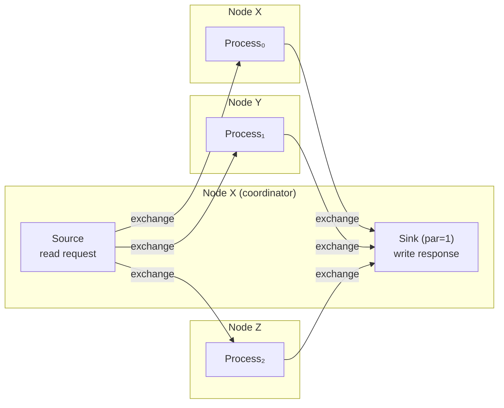

The coordinator's `spawn()` waits for the sink stage to finish,
which is last by construction (it's the pipeline tail receiving
`SenderDone` from all upstream senders). The response stream stays
open until all results have been delivered. Other nodes' `spawn()`
calls return earlier as their upstream stages complete.

##### Batch / Store Pattern

When results are written to an external store (database, S3, etc.), the
sink can run on any node — or even be distributed across nodes. Each
node's `spawn()` returns when its local sink workers finish writing.
The coordinator may finish before all writes complete on other nodes.

If the coordinator needs to confirm all writes are done, it can:
- Use a probe on the final operator (probe frontier reflects global
  completion transitively)
- Add an explicit fan-in exchange to collect acknowledgments

##### Stage Placement

The StageExecutor model enables per-stage placement control. Since each
stage is an independent scheduling unit, the runtime can assign stages
to specific nodes.

When configuring the cluster topology, the user can optionally inform
the dataflow which node should host specific stages — most commonly the
final single-worker collector stage:

```rust
// Cluster topology configuration
let config = ClusterConfig::new()
    .add_node("node-x", addr_x)   // coordinator
    .add_node("node-y", addr_y)
    .add_node("node-z", addr_z)
    .collector_node("node-x");    // optional: single-worker stages
                                  // prefer this node
```

The runtime's stage-to-node assignment logic:
- **Multi-worker stages** (par > 1): distribute workers round-robin
  across all nodes
- **Single-worker stages** (par = 1): assign to the collector node if
  configured, otherwise to the node that initiated the dataflow
- **Future: explicit placement**: `Placement::Node(id)` on individual
  stages for fine-grained control

This is a soft hint, not a hard constraint — the runtime can override
placement if the target node is unavailable. For the response stream
pattern, setting `collector_node` to the coordinator ensures the sink
runs locally and `spawn()` returns only after all results are delivered.

#### Cancellation

Cancellation is orthogonal to progress tracking. It uses a **shared
per-dataflow `CancellationToken`** that all StageExecutors observe.

**Same-process cancellation:**

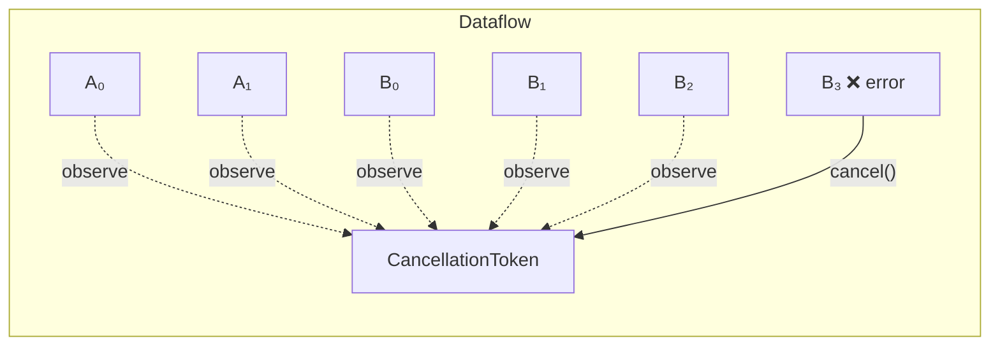

When any StageExecutor encounters an error, it calls `token.cancel()`.
All other executors observe `token.is_cancelled()` on their next poll
and shut down. This works in all directions — downstream failures cancel
upstream, and vice versa.

**Cross-node cancellation:**

```mermaid
sequenceDiagram
    participant B3 as Node B: Stage executor (error)
    participant BT as Node B: CancellationToken
    participant Ctrl as Control Channel (ID 0)
    participant AT as Node A: CancellationToken
    participant AExec as Node A: All executors

    B3->>BT: cancel("operator failed: ...")
    Note over BT: All local executors stop
    BT->>Ctrl: ControlMessage::Cancel { reason }
    Ctrl->>AT: Cancel message received
    AT->>AT: cancel() triggered
    Note over AExec: All remote executors stop
```

Instancy's control protocol already has a `Cancel` message type
(wire format: `[2][reason_len: u32][reason: UTF-8][crc32]`) sent on
control channel ID 0. When a node's `CancellationToken` fires, it
broadcasts `Cancel` to all peer nodes, which trigger their own tokens.

**No changes needed**: The `CancellationToken` + control protocol layer
sits above the executor level. The StageExecutor refactoring does not
affect cancellation — each executor simply holds a `token.clone()`.

#### Summary

| Concern | Mechanism | Global view needed? |
|---|---|---|
| Frontier observation (probe) | Local to stage, transitive | No — transitivity provides it |
| Completion detection | `DataflowCompletionBarrier` (atomic countdown) | No — cascading `SenderDone` + barrier |
| Cancellation | `CancellationToken` + control protocol | No — out-of-band broadcast |

### Migration Path

The StageExecutor model is a significant architectural change. It can be
introduced incrementally:

1. **Phase 1:** Implement `StageExecutor` alongside `DataflowExecutor`.
   Single-stage dataflows (no exchanges) use `StageExecutor` with identical
   behavior to today.

2. **Phase 2:** Multi-stage linear pipelines (no loops). Exchange channels
   carry frontier updates. Test with existing staged parallelism tests.

3. **Phase 3:** Feedback loops. Cross-stage feedback channels with frontier
   propagation. Test with `iterate()` + exchange combinations.

4. **Phase 4:** Remove ghost operator infrastructure from `DataflowExecutor`.
   Remove the separate progress exchange system. `spawn_staged_internal`
   creates StageExecutors directly.

### Frontier Transitivity

A critical simplification: **each stage only aggregates frontiers from its
direct predecessors**, not from all upstream stages.

Consider `A (par=2) → exchange → B (par=4) → exchange → C (par=3)`:

- Stage C receives exchange channels from B's 4 workers → aggregates **4**
  frontiers.
- Stage C does NOT need to know anything about A. B's output frontier
  already reflects A's frontier transitively: B cannot advance its output
  frontier past time T until it has received all data at time ≤T from A.

This means frontier aggregation is always local to adjacent stages. The
`FrontierAggregator` at each exchange input tracks exactly
`source_stage.parallelism` senders — never more.

For diamond topologies where a stage has multiple predecessor stages:

```mermaid
graph LR
    B["B (par=4)"] -->|"4 senders"| D["D (par=2)"]
    C["C (par=3)"] -->|"3 senders"| D
```

Stage D has two exchange inputs and aggregates separately:
- B→D: 4 senders → one aggregated frontier
- C→D: 3 senders → one aggregated frontier

D's effective input frontier = min(B→D aggregate, C→D aggregate).
Total senders tracked: 4 + 3 = 7 (not 4 × 3).

### Ordering Guarantee: Inline Watermarks on FIFO Channels

This design requires per-channel FIFO ordering — a `FrontierUpdate` for
time T must arrive after all `DataBatch` messages at time ≤ T on the same
channel.

**In-process channels** (bounded queues) are FIFO by construction.

**Cross-process channels** use instancy's shared connection pool, where a
single logical stream `(dataflow_id, channel_id)` may be multiplexed across
multiple TCP connections. TCP guarantees FIFO within a single connection,
but when frames travel over **different** connections, network-level FIFO
is broken. Instancy's messaging layer restores ordering:

1. **SequenceCounter**: Each logical stream stamps every frame with a
   monotonically increasing `u64` sequence ID.
2. **ReorderBuffer**: At the receiver, per logical stream. Delivers
   in-order frames immediately, buffers out-of-order arrivals in a
   `BTreeMap<seq_id, payload>`, and times out if a gap persists.

```mermaid
sequenceDiagram
    participant S as Sender
    participant P as Connection Pool
    participant R as ReorderBuffer

    S->>P: Frame(seq=0, DataBatch T=5)
    S->>P: Frame(seq=1, DataBatch T=5)
    S->>P: Frame(seq=2, FrontierUpdate past T=5)
    Note over P: Frames may travel on<br/>different TCP connections
    P->>R: Frame(seq=2) arrives first!
    Note over R: seq=2 buffered (gap: need 0,1)
    P->>R: Frame(seq=0) arrives
    Note over R: seq=0 delivered immediately
    P->>R: Frame(seq=1) arrives
    Note over R: seq=1 delivered, then seq=2<br/>All in original order ✓
```

This means the inline watermark model works correctly over the network —
the `FrontierUpdate` is guaranteed to be delivered after all preceding
`DataBatch` messages on the same logical stream, regardless of how many
TCP connections carry the frames.

```mermaid
sequenceDiagram
    participant S as Sender (Stage A, worker 0)
    participant Ch as FIFO Channel
    participant R as Receiver (Stage B, worker 0)

    S->>Ch: DataBatch(T=5, [a,b,c])
    S->>Ch: DataBatch(T=5, [d,e])
    S->>Ch: FrontierUpdate(past T=5)
    Note over Ch: FIFO order preserved
    Ch->>R: DataBatch(T=5, [a,b,c])
    Ch->>R: DataBatch(T=5, [d,e])
    Ch->>R: FrontierUpdate(past T=5)
    Note over R: All T=5 data received<br/>before frontier advances
```

By contrast, timely uses separate channels for data and progress.
To prevent premature frontier advance, the exchange operator holds
a **capability counter** for in-flight data:

```mermaid
sequenceDiagram
    participant Op as Operator A
    participant Ex as Exchange Operator
    participant PC as Progress Channel
    participant DC as Data Channel
    participant B as Operator B

    Op->>Ex: push DataBatch(T=5)
    Note over Ex: acquires cap(T=5, +1)
    Op->>Op: drop Capability(T=5)
    Note over Op: reports (A, T=5, -1)

    par Broadcast atomically
        Op->>PC: [(A,T=5,-1), (Ex,T=5,+1)]
    and Send data
        Ex->>DC: DataBatch(T=5)
    end

    Note over B: Progress arrives first!
    PC->>B: [(A,T=5,-1), (Ex,T=5,+1)]
    Note over B: Net: Ex still holds cap<br/>→ frontier stays at T=5 ✓

    DC->>B: DataBatch(T=5) arrives
    Ex->>PC: [(Ex,T=5,-1)]
    PC->>B: [(Ex,T=5,-1)]
    Note over B: Net: 0 caps at T=5<br/>→ frontier advances past T=5 ✓
```

### Comparison with Current Design

| Aspect | Current (DataflowExecutor) | Proposed (StageExecutor) |
|--------|---------------------------|-------------------------|
| Executors per dataflow | max(P_i) | sum(P_i) |
| Graph per executor | Full (with ghosts) | Stage only |
| Progress exchange | All-to-all broadcast (separate channel) | Inline via exchange channels |
| Ghost operators | Required for non-participating stages | Not needed |
| Loop handling | Single reachability graph | Cross-stage feedback channels |
| Scheduling | One executor polls all stages | Independent per-stage scheduling |
| Progress message complexity | O(N²) per round (N = max parallelism) | O(M×N) per exchange edge |

### Why Inline Watermarks Over Broadcast Counting

Timely-dataflow uses **all-to-all broadcast + pointstamp counting** for
progress tracking. This section compares the two approaches and explains
why we choose inline watermarks for instancy's per-stage dynamic parallelism.

#### Timely's Broadcast + Counting

Every worker holds the **full dataflow graph** and broadcasts `(operator,
port, timestamp, ±1)` capability deltas to all N-1 peers. Each worker's
reachability tracker maintains a global picture of all capabilities across
all workers.

**Pros:**

- **Order-independent**: Capability deltas are additive integers. Messages
  from different workers can arrive in any order — `(+1, -1)` and `(-1, +1)`
  both produce net 0. Only per-sender FIFO is needed (to avoid observing a
  drop before an acquire from the same worker).

- **Global visibility**: Every worker knows every other worker's capabilities.
  This enables global optimization decisions and makes completion detection
  straightforward — the dataflow is done when `total_counts == 0`.

- **Proven correctness**: Timely's progress protocol has been formally
  reasoned about and battle-tested in production systems (Naiad, Differential
  Dataflow).

**Cons:**

- **O(N²) message complexity**: Each worker broadcasts to N-1 peers every
  propagation round. For a dataflow with `max_parallelism = 64`, that's
  ~4000 progress messages per round, even if most stages have lower
  parallelism.

- **Ghost operators required for dynamic parallelism**: When stages have
  different parallelism (e.g., stage A par=2, stage B par=8), workers that
  don't participate in a stage need ghost operators — placeholder nodes in
  the reachability graph that ensure peer progress updates propagate
  correctly across stage boundaries. This adds complexity:
  - Ghost operators have shapes but no capabilities or progress buffers
  - The reachability graph is larger than necessary (full graph × max workers)
  - `mark_ghost_operators()` must carefully strip capabilities without
    breaking graph connectivity

- **All workers coupled**: Every worker must process every other worker's
  progress updates, even for stages it doesn't participate in. A slow
  worker in stage C delays progress visibility in unrelated stage A.

- **Separate progress channel**: Requires a dedicated N×(N-1) channel
  infrastructure parallel to the data channels. For cross-node clusters,
  this means additional TCP connections or multiplexed streams solely for
  progress.

#### Inline Watermarks (Proposed)

Each exchange channel carries `FrontierUpdate` messages inline with data.
Progress information flows through the same channels as data, in FIFO
order. Each StageExecutor tracks only its local operators' progress and
aggregates input frontiers from its direct predecessor stages.

**Pros:**

- **Natural fit for dynamic parallelism**: Each stage is self-contained.
  Stage A (par=2) and stage B (par=8) create 2 + 8 = 10 StageExecutors,
  each with a minimal local graph. No ghost operators, no wasted work.

- **O(M×N) message complexity per exchange**: Between two adjacent stages
  with parallelism M and N, there are M×N channels, each carrying its own
  frontier updates. Total progress messages = number of exchange channels,
  not number of workers squared.

- **Local reasoning**: Each StageExecutor only needs to know about its
  direct predecessors' frontiers. No global graph, no tracking capabilities
  of unrelated stages. Simpler to reason about correctness.

- **No separate progress infrastructure**: Progress reuses the data channel
  — no additional channels, connections, or bridge tasks needed. Reduces
  transport complexity.

- **Independent scheduling**: Stages are decoupled. A slow stage C doesn't
  affect progress tracking in stage A — stage A's output frontier advances
  as soon as its own operators complete, regardless of downstream.

- **Simpler implementation**: No `SubgraphBuilder::mark_ghost_operators()`,
  no `WorkerProgressChannels`, no `broadcast_local_changes()` /
  `receive_peer_changes()`. The `FrontierAggregator` is a simple
  `min(per_sender_frontiers)` computation.

**Cons:**

- **Requires FIFO channels**: Frontier updates must arrive after all
  preceding data on the same channel. In-process queues and TCP provide
  this natively. For pooled connections where frames may travel over
  different TCP connections, instancy's `SequenceCounter` +
  `ReorderBuffer` restores ordering (already implemented).

- **No global visibility**: A StageExecutor doesn't know about stages
  beyond its direct predecessors/successors. Global completion detection
  requires coordination across all StageExecutors (e.g., all executors
  report "done" to a central coordinator or through cascading completion
  signals).

- **Frontier latency through deep pipelines**: In a chain of N stages,
  a frontier advance at stage 1 must propagate through stages 2, 3, ..., N
  sequentially. Timely's broadcast delivers to all workers simultaneously.
  However, this is rarely a bottleneck — data must also travel through the
  pipeline, so frontier latency tracks data latency.

- **Cross-stage loops add complexity**: Feedback edges that cross stages
  create cycles in the stage graph. The inline model handles this via
  cross-stage feedback channels (same mechanism as forward exchange), but
  reasoning about termination in cyclic stage graphs requires care.

#### Why Watermarks for Instancy

The decisive factor is **dynamic per-stage parallelism**. Instancy's design
goal is that each stage independently chooses its parallelism:

```
source (par=1) → parse (par=4) → exchange → aggregate (par=2) → sink (par=1)
```

With broadcast counting, this requires `max(1,4,2,1) = 4` executors, where
3 of them carry ghost operators for stages they don't participate in. The
ghost operator complexity grows with the number of stages and the variance
in parallelism.

```mermaid
graph TD
    subgraph "Broadcast counting: 4 executors × full graph"
        E0["Executor 0: src → parse → agg → sink"]
        E1["Executor 1: 👻src → parse → agg → sink"]
        E2["Executor 2: 👻src → parse → 👻agg → 👻sink"]
        E3["Executor 3: 👻src → parse → 👻agg → 👻sink"]
    end
```

```mermaid
graph TD
    subgraph "Inline watermarks: 8 StageExecutors, no ghosts"
        subgraph "Stage: source (par=1)"
            S0["src₀"]
        end
        subgraph "Stage: parse (par=4)"
            P0["parse₀"]
            P1["parse₁"]
            P2["parse₂"]
            P3["parse₃"]
        end
        subgraph "Stage: aggregate (par=2)"
            A0["agg₀"]
            A1["agg₁"]
        end
        subgraph "Stage: sink (par=1)"
            K0["sink₀"]
        end
        S0 --> P0
        S0 --> P1
        S0 --> P2
        S0 --> P3
        P0 --> A0
        P0 --> A1
        P1 --> A0
        P1 --> A1
        P2 --> A0
        P2 --> A1
        P3 --> A0
        P3 --> A1
        A0 --> K0
        A1 --> K0
    end
```

With inline watermarks, each executor is minimal and self-contained.
The total work scales with `sum(parallelisms)` not `stages × max(parallelism)`.
For production dataflows with many stages at varying parallelism, this
eliminates significant wasted computation in ghost operator progress
tracking.
